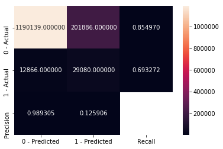
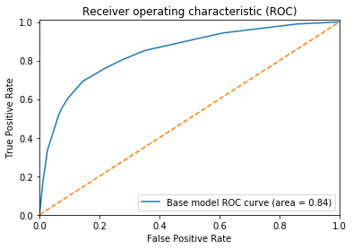

# Metrics
Contains common functions to measure performance of a model. 
## print_confusion_matrix
Prints the confusion matrix using seaborn.

Input:
* y_test - true labels.
* y_pred - predicted labels.
* positive_label - what is the positive label.
* negative_label - what is the negative label.

Example:
```python
from sklearn.tree import DecisionTreeClassifier
from ds_utils.metrics import plot_confusion_matrix


model = DecisionTreeClassifier()
model.fit(X_train, y_train)
plot_confusion_matrix(y_test, model.predict(X_test), 1, 0)
```

Output:
```bash
False Positive Rate: 0.1450
False Negative Rate: 0.3067
Confusion Matrix:
```

```
Accuracy: 0.8502
F1 Score: 0.2131
```

## plot_roc_curve
Prints the roc curve using matplotlib.

Input:
* y_test - true labels.
* classifiers_scores_dict - dictionary of classifier name and predicted probability for positive label.
* positive_label - what is the positive label.

Example:
```python
from sklearn.tree import DecisionTreeClassifier
from ds_utils.metrics import plot_roc_curve_binary_class


model = DecisionTreeClassifier()
model.fit(X_train, y_train)
plot_roc_curve_binary_class(y_test, {"Base model": model.predict_proba(X_test)[:, 1]}, 1)
```

Output:



[back to index](index.md)