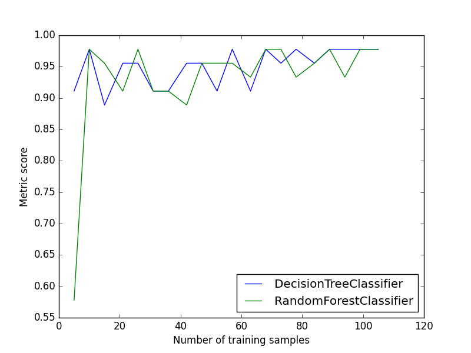
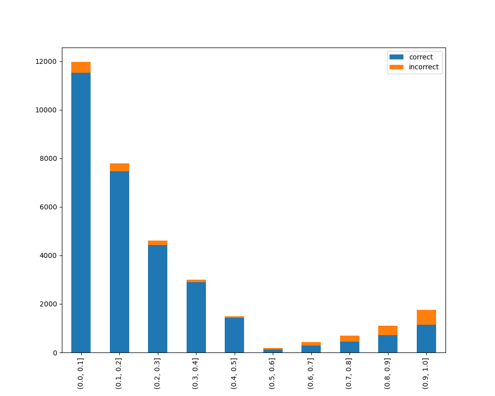

#######
Metrics
#######

The module of metrics contains methods that help to calculate and/or visualize evaluation performance of an algorithm.

*********************
Plot Confusion Matrix
*********************

.. autofunction:: metrics::plot_confusion_matrix

.. highlight:: python

Code Examples
=============
In following examples we are going to use the iris dataset from scikit-learn. so firstly let's import it::

    import numpy
    from sklearn import datasets

    IRIS = datasets.load_iris()
    RANDOM_STATE = numpy.random.RandomState(0)

Next we'll add a small function to add noise::

    def _add_noisy_features(x, random_state):
        n_samples, n_features = x.shape
        return numpy.c_[x, random_state.randn(n_samples, 200 * n_features)]

Binary Classification
---------------------

So We'll use the only first two classes in the iris dataset, build a SVM classifier and evaluate it::

    from matplotlib import pyplot
    from sklearn.model_selection import train_test_split
    from sklearn import svm

    from ds_utils.metrics import plot_confusion_matrix

    x = IRIS.data
    y = IRIS.target

    # Add noisy features
    x = _add_noisy_features(x, RANDOM_STATE)

    # Limit to the two first classes, and split into training and test
    x_train, x_test, y_train, y_test = train_test_split(x[y < 2], y[y < 2], test_size=.5,
                                            random_state=RANDOM_STATE)

    # Create a simple classifier
    classifier = svm.LinearSVC(random_state=RANDOM_STATE)
    classifier.fit(x_train, y_train)
    y_pred = classifier.predict(x_test)

    plot_confusion_matrix(y_test, y_pred, [1, 0])

    pyplot.show()

And the following image will be shown:

.. image:: ../../tests/baseline_images/test_metrics/test_print_confusion_matrix_binary.png
    :align: center
    :alt: binary classification confusion matrix

Multi-Label Classification
--------------------------

This time we'll train on all the classes and plot an evaluation::

    from matplotlib import pyplot
    from sklearn.model_selection import train_test_split
    from sklearn.multiclass import OneVsRestClassifier
    from sklearn import svm

    from ds_utils.metrics import plot_confusion_matrix

    x = IRIS.data
    y = IRIS.target

    # Add noisy features
    x = _add_noisy_features(x, RANDOM_STATE)

    x_train, x_test, y_train, y_test = train_test_split(x, y, test_size=.5, random_state=RANDOM_STATE)

    # Create a simple classifier
    classifier = OneVsRestClassifier(svm.LinearSVC(random_state=RANDOM_STATE))
    classifier.fit(x_train, y_train)
    y_pred = classifier.predict(x_test)

    plot_confusion_matrix(y_test, y_pred, [0, 1, 2])
    pyplot.show()

And the following image will be shown:

.. image:: ../../tests/baseline_images/test_metrics/test_print_confusion_matrix.png
    :align: center
    :alt: multi label classification confusion matrix

****************************************
Plot Metric Growth per Labeled Instances
****************************************

.. autofunction:: metrics::plot_metric_growth_per_labeled_instances

Code Example
============
In this example we'll divide the data into train and test sets, decide on which classifiers we want to measure and plot
the results::

    from matplotlib import pyplot
    from sklearn.ensemble import RandomForestClassifier
    from sklearn.model_selection import train_test_split
    from sklearn.tree import DecisionTreeClassifier

    from ds_utils.metrics import plot_metric_growth_per_labeled_instances

    x = IRIS.data
    y = IRIS.target

    x_train, x_test, y_train, y_test = train_test_split(x, y, test_size=.3, random_state=0)
    plot_metric_growth_per_labeled_instances(x_train, y_train, x_test, y_test,
                                             {"DecisionTreeClassifier":
                                                DecisionTreeClassifier(random_state=0),
                                              "RandomForestClassifier":
                                                RandomForestClassifier(random_state=0, n_estimators=5)})
    pyplot.show()

And the following image will be shown:

*****************************************
Visualize Accuracy Grouped by Probability
*****************************************
This method was created due the lack of maintenance of the package `EthicalML / xai <https://github.com/EthicalML/XAI>`_.

.. autofunction:: metrics::visualize_accuracy_grouped_by_probability

Code Example
============
The example uses a small sample from of a dataset from
`kaggle <https://www.kaggle.com/mrferozi/loan-data-for-dummy-bank>`_, which a dummy bank provides loans.

Let's see how to use the code::

    from matplotlib import pyplot
    from sklearn.ensemble import RandomForestClassifier

    from ds_utils.metrics import visualize_accuracy_grouped_by_probability

    loan_data = pandas.read_csv(path/to/dataset, encoding="latin1", nrows=11000,
                                 parse_dates=["issue_d"])
                                 .drop("id", axis=1)
    loan_data = loan_data.drop("application_type", axis=1)
    loan_data = loan_data.sort_values("issue_d")
    loan_data = pandas.get_dummies(loan_data)
    train = loan_data.head(int(loan_data.shape[0] * 0.7)).sample(frac=1)
            .reset_index(drop=True).drop("issue_d", axis=1)
    test = loan_data.tail(int(loan_data.shape[0] * 0.3)).drop("issue_d", axis=1)

    selected_features = ['emp_length_int', 'home_ownership_MORTGAGE', 'home_ownership_RENT',
                         'income_category_Low', 'term_ 36 months', 'purpose_debt_consolidation',
                         'purpose_small_business', 'interest_payments_High']
    classifier = RandomForestClassifier(min_samples_leaf=int(train.shape[0] * 0.01),
                                        class_weight="balanced",
                                        n_estimators=1000, random_state=0)
    classifier.fit(train[selected_features], train["loan_condition_cat"])

    probabilities = classifier.predict_proba(test[selected_features])
    visualize_accuracy_grouped_by_probability(test["loan_condition_cat"], 1, probabilities[:, 1],
                                              display_breakdown=False)

    pyplot.show()

And the following image will be shown:

If we chose to display the breakdown::

    visualize_accuracy_grouped_by_probability(test["loan_condition_cat"], 1, probabilities[:, 1],
                                              display_breakdown=True)
    pyplot.show()

And the following image will be shown:

.. image:: ../../tests/baseline_images/test_metrics/test_visualize_accuracy_grouped_by_probability_with_breakdown.png
    :align: center
    :alt: Visualize Accuracy Grouped by Probability with Breakdown