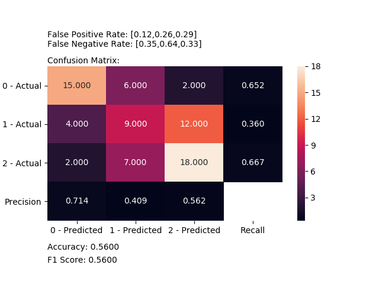

*******
Metrics
*******
The module of metrics contains methods that help to calculate and/or visualize evaluation performance of an algorithm.

Plot Confusion Matrix
=====================

.. autofunction:: metrics::plot_confusion_matrix

.. highlight:: python

Code Examples
*************
In following examples we are going to use the iris dataset from scikit-learn. so firstly let's import it::

    import numpy
    from sklearn import datasets

    IRIS = datasets.load_iris()
    RANDOM_STATE = numpy.random.RandomState(0)

Next we'll add a small function to add noise::

    def _add_noisy_features(x, random_state):
        n_samples, n_features = x.shape
        return numpy.c_[x, random_state.randn(n_samples, 200 * n_features)]

**Binary Classification**

So We'll use the only first two classes in the iris dataset, build a SVM classifier and evaluate it::

    from matplotlib import pyplot
    from sklearn.model_selection import train_test_split
    from sklearn import svm

    from ds_utils.metrics import plot_confusion_matrix

    x = IRIS.data
    y = IRIS.target

    # Add noisy features
    x = _add_noisy_features(x, RANDOM_STATE)

    # Limit to the two first classes, and split into training and test
    x_train, x_test, y_train, y_test = train_test_split(x[y < 2], y[y < 2], test_size=.5,
                                            random_state=RANDOM_STATE)

    # Create a simple classifier
    classifier = svm.LinearSVC(random_state=RANDOM_STATE)
    classifier.fit(x_train, y_train)
    y_pred = classifier.predict(x_test)

    plot_confusion_matrix(y_test, y_pred, [1, 0])

    pyplot.show()

And the following image will be shown:

**Multi-Label Classification**

This time we'll train on all the classes and plot an evaluation::

    from matplotlib import pyplot
    from sklearn.model_selection import train_test_split
    from sklearn.multiclass import OneVsRestClassifier
    from sklearn import svm

    from ds_utils.metrics import plot_confusion_matrix

    x = IRIS.data
    y = IRIS.target

    # Add noisy features
    x = _add_noisy_features(x, RANDOM_STATE)

    x_train, x_test, y_train, y_test = train_test_split(x, y, test_size=.5, random_state=RANDOM_STATE)

    # Create a simple classifier
    classifier = OneVsRestClassifier(svm.LinearSVC(random_state=RANDOM_STATE))
    classifier.fit(x_train, y_train)
    y_pred = classifier.predict(x_test)

    plot_confusion_matrix(y_test, y_pred, [0, 1, 2])
    pyplot.show()

And the following image will be shown:

