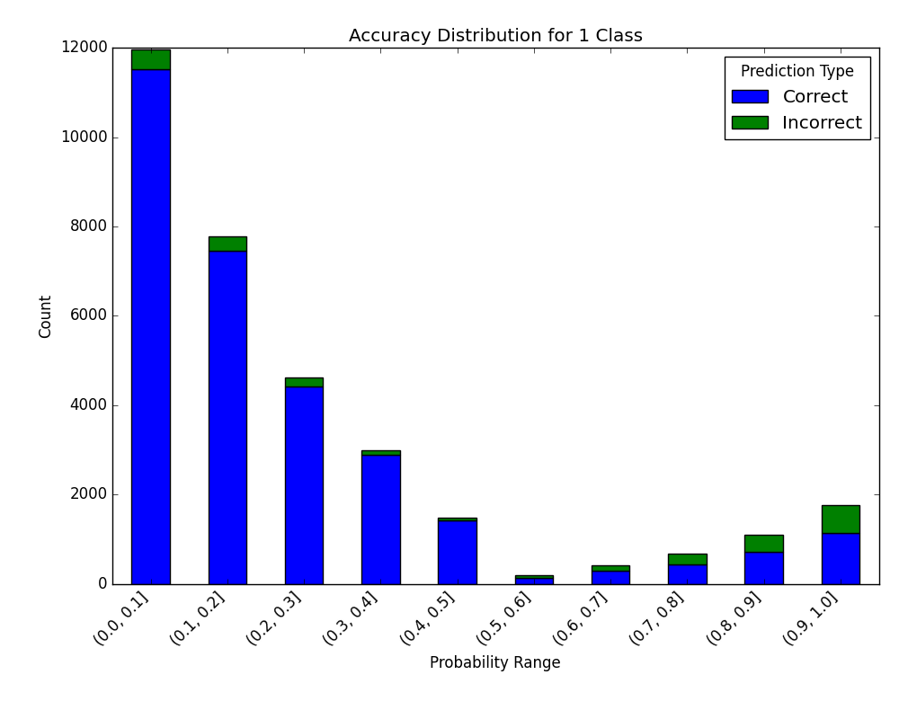
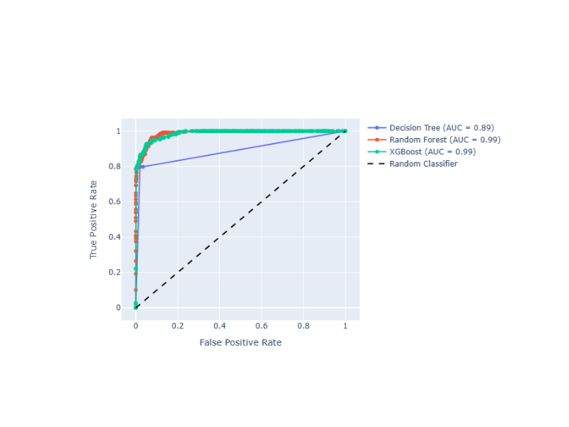
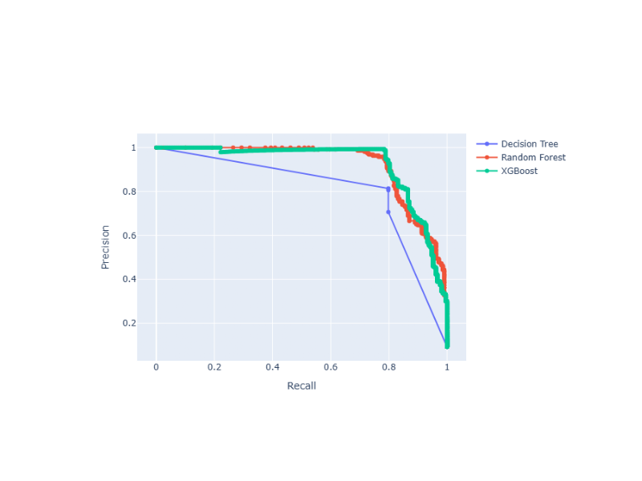

#######
Metrics
#######

The module of metrics contains methods that help to calculate and/or visualize evaluation performance of an algorithm.

*********************
Plot Confusion Matrix
*********************

.. autofunction:: metrics::plot_confusion_matrix

.. highlight:: python

Code Examples
=============
In the following examples, we are going to use the iris dataset from scikit-learn. First, let's import it::

    import numpy as np
    from sklearn import datasets

    IRIS = datasets.load_iris()
    RANDOM_STATE = np.random.RandomState(0)

Next, we'll add a small function to add noise::

    def _add_noisy_features(x, random_state):
        n_samples, n_features = x.shape
        return numpy.c_[x, random_state.randn(n_samples, 200 * n_features)]

Binary Classification
---------------------

We'll use only the first two classes in the iris dataset, build an SVM classifier and evaluate it::

    from matplotlib import pyplot as plt
    from sklearn.model_selection import train_test_split
    from sklearn import svm

    from ds_utils.metrics import plot_confusion_matrix

    # Load and prepare the data
    features = IRIS.data
    labels = IRIS.target

    # Add noisy features to make the problem harder
    features = _add_noisy_features(features, RANDOM_STATE)

    # Limit to the two first classes, and split into training and test
    X_train, X_test, y_train, y_test = train_test_split(features[labels < 2], labels[labels < 2],
                                                        test_size=.5, random_state=RANDOM_STATE)

    # Create a simple classifier
    classifier = svm.LinearSVC(random_state=RANDOM_STATE)
    classifier.fit(X_train, y_train)
    y_pred = classifier.predict(X_test)

    plot_confusion_matrix(y_test, y_pred, [1, 0])

    plt.show()

And the following image will be shown:

Multi-Label Classification
--------------------------

This time, we'll train on all the classes and plot an evaluation::

    from matplotlib import pyplot as plt
    from sklearn.model_selection import train_test_split
    from sklearn.multiclass import OneVsRestClassifier
    from sklearn import svm

    from ds_utils.metrics import plot_confusion_matrix

    # Load and prepare the data
    features = IRIS.data
    labels = IRIS.target

    # Add noisy features to make the problem harder
    features = _add_noisy_features(features, RANDOM_STATE)

    X_train, X_test, y_train, y_test = train_test_split(features, labels, test_size=.5, random_state=RANDOM_STATE)

    # Create a simple classifier
    # OneVsRestClassifier is used for multi-class classification
    classifier = OneVsRestClassifier(svm.LinearSVC(random_state=RANDOM_STATE))
    classifier.fit(X_train, y_train)
    y_pred = classifier.predict(X_test)

    plot_confusion_matrix(y_test, y_pred, [0, 1, 2])
    plt.show()

And the following image will be shown:

****************************************
Plot Metric Growth per Labeled Instances
****************************************

.. autofunction:: metrics::plot_metric_growth_per_labeled_instances

Code Example
============
In this example, we'll divide the data into train and test sets, decide on which classifiers we want to measure, and plot
the results::

    from matplotlib import pyplot as plt
    from sklearn.ensemble import RandomForestClassifier
    from sklearn.model_selection import train_test_split
    from sklearn.tree import DecisionTreeClassifier

    from ds_utils.metrics import plot_metric_growth_per_labeled_instances

    # Load and prepare the data
    features = IRIS.data
    labels = IRIS.target

    X_train, X_test, y_train, y_test = train_test_split(features, labels, test_size=.3, random_state=0)

    # Define classifiers to compare
    classifiers = {
        "DecisionTreeClassifier": DecisionTreeClassifier(random_state=0),
        "RandomForestClassifier": RandomForestClassifier(random_state=0, n_estimators=5)
    }

    # Plot metric growth for different amounts of training data
    plot_metric_growth_per_labeled_instances(X_train, y_train, X_test, y_test, classifiers)
    plt.show()

And the following image will be shown:

*****************************************
Visualize Accuracy Grouped by Probability
*****************************************
This method was created due to the lack of maintenance of the package `EthicalML / xai <https://github.com/EthicalML/XAI>`_.

.. autofunction:: metrics::visualize_accuracy_grouped_by_probability

Code Example
============
The example uses a small sample from a dataset from
`kaggle <https://www.kaggle.com/mrferozi/loan-data-for-dummy-bank>`_, which a dummy bank provides loans.

Let's see how to use the code::

    from matplotlib import pyplot as plt
    from sklearn.ensemble import RandomForestClassifier

    from ds_utils.metrics import visualize_accuracy_grouped_by_probability

    # Load and prepare the data
    loan_data = pandas.read_csv(path/to/dataset, encoding="latin1", nrows=11000,
                                parse_dates=["issue_d"])
    loan_data = loan_data.drop(["id", "application_type"], axis=1)
    loan_data = loan_data.sort_values("issue_d")
    loan_data = pandas.get_dummies(loan_data)

    # Prepare train and test sets
    train = (loan_data.head(int(loan_data.shape[0] * 0.7))
             .sample(frac=1)
             .reset_index(drop=True)
             .drop("issue_d", axis=1))
    test = loan_data.tail(int(loan_data.shape[0] * 0.3)).drop("issue_d", axis=1)

    # Define features to use for classification
    selected_features = [
        'emp_length_int', 'home_ownership_MORTGAGE', 'home_ownership_RENT',
        'income_category_Low', 'term_ 36 months', 'purpose_debt_consolidation',
        'purpose_small_business', 'interest_payments_High'
    ]

    # Train the classifier
    classifier = RandomForestClassifier(
        min_samples_leaf=int(train.shape[0] * 0.01),
        class_weight="balanced",
        n_estimators=1000,
        random_state=0
    )
    classifier.fit(train[selected_features], train["loan_condition_cat"])

    # Make predictions and visualize accuracy
    probabilities = classifier.predict_proba(test[selected_features])
    visualize_accuracy_grouped_by_probability(
        test["loan_condition_cat"],
        1,
        probabilities[:, 1],
        display_breakdown=False
    )

    plt.show()

And the following image will be shown:

If we choose to display the breakdown::

    visualize_accuracy_grouped_by_probability(
        test["loan_condition_cat"],
        1,
        probabilities[:, 1],
        display_breakdown=True
    )
    plt.show()

And the following image will be shown:

*****************************************************************************************
Receiver Operating Characteristic (ROC) Curve with Probabilities (Thresholds) Annotations
*****************************************************************************************

The ROC curve is a graphical plot that illustrates the diagnostic ability of a binary classifier system as its discrimination threshold is varied. It plots the True Positive Rate (TPR) against the False Positive Rate (FPR) at various threshold settings. The ROC curve is particularly useful when you have balanced classes or when you want to evaluate the classifier's performance across all possible thresholds.

.. autofunction:: metrics::plot_roc_curve_with_thresholds_annotations

Code Example
============
Suppose that we want to compare 3 classifiers based on ROC Curve and optimize the prediction threshold. The method uses
Plotly as the backend engine to create the graphs and adds the AUC score next to each classifier name::

    from sklearn.tree import DecisionTreeClassifier
    from sklearn.ensemble import RandomForestClassifier
    from xgboost import XGBClassifier

    from ds_utils.metrics import plot_roc_curve_with_thresholds_annotations

    # Define and train classifiers
    tree_clf = DecisionTreeClassifier(random_state=42)
    rf_clf = RandomForestClassifier(random_state=42)
    xgb_clf = XGBClassifier(random_state=42, eval_metric='logloss')

    tree_clf.fit(X_train, y_train)
    rf_clf.fit(X_train, y_train)
    xgb_clf.fit(X_train, y_train)

    # Prepare classifier predictions
    classifiers_names_and_scores_dict = {
        "Decision Tree": tree_clf.predict_proba(X_test)[:, 1],
        "Random Forest": rf_clf.predict_proba(X_test)[:, 1],
        "XGBoost": xgb_clf.predict_proba(X_test)[:, 1]
    }

    # Plot ROC curves
    fig = plot_roc_curve_with_thresholds_annotations(
        y_test,
        classifiers_names_and_scores_dict,
        positive_label=1
    )
    fig.show()

The `positive_label=1` parameter specifies which class should be considered as the positive class when calculating the ROC curve. In this case, it indicates that the class labeled as '1' is the positive class.

And the following interactive graph will be shown:

******************************************************************
Precision-Recall Curve with Probabilities (Thresholds) Annotations
******************************************************************

The Precision-Recall curve shows the tradeoff between precision and recall for different threshold values. It is particularly useful when you have imbalanced classes, as it focuses on the performance of the positive class. Precision-Recall curves are preferred over ROC curves when you have a large skew in the class distribution, as they are more sensitive to differences in the minority class.

.. autofunction:: metrics::plot_precision_recall_curve_with_thresholds_annotations

Code Example
============
Suppose that we want to compare 3 classifiers based on Precision-Recall Curve and optimize the prediction threshold.
The method uses Plotly as the backend engine to create the graphs::

    from sklearn.tree import DecisionTreeClassifier
    from sklearn.ensemble import RandomForestClassifier
    from xgboost import XGBClassifier

    from ds_utils.metrics import plot_precision_recall_curve_with_thresholds_annotations

    # Define and train classifiers
    tree_clf = DecisionTreeClassifier(random_state=42)
    rf_clf = RandomForestClassifier(random_state=42)
    xgb_clf = XGBClassifier(random_state=42, eval_metric='logloss')

    tree_clf.fit(X_train, y_train)
    rf_clf.fit(X_train, y_train)
    xgb_clf.fit(X_train, y_train)

    # Prepare classifier predictions
    classifiers_names_and_scores_dict = {
        "Decision Tree": tree_clf.predict_proba(X_test)[:, 1],
        "Random Forest": rf_clf.predict_proba(X_test)[:, 1],
        "XGBoost": xgb_clf.predict_proba(X_test)[:, 1]
    }

    # Plot Precision-Recall curves
    fig = plot_precision_recall_curve_with_thresholds_annotations(
        y_test,
        classifiers_names_and_scores_dict,
        positive_label=1
    )
    fig.show()

Similar to the ROC curve example, the `positive_label=1` parameter here specifies that the class labeled as '1' should be considered as the positive class when calculating the Precision-Recall curve.

And the following interactive graph will be shown:

