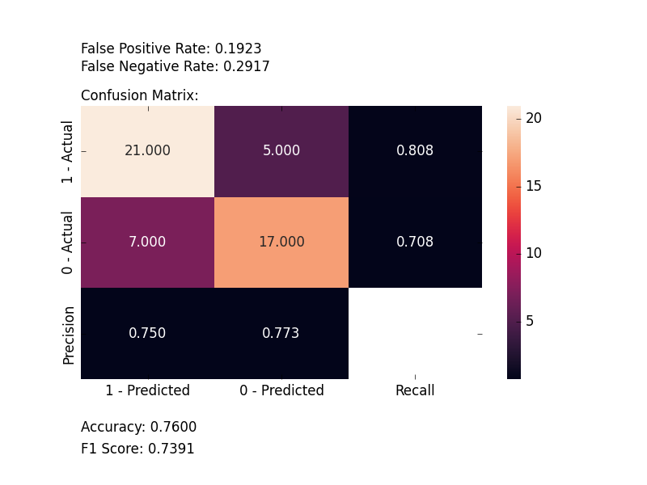

*********************
Plot Confusion Matrix
*********************

.. autofunction:: ds_utils.metrics.confusion_matrix.plot_confusion_matrix

.. highlight:: python

Code Examples
=============
In the following examples, we are going to use the iris dataset from scikit-learn. First, let's import it::

    import numpy as np
    from sklearn import datasets

    IRIS = datasets.load_iris()
    RANDOM_STATE = np.random.RandomState(0)

Next, we'll add a small function to add noise::

    def _add_noisy_features(x, random_state):
        n_samples, n_features = x.shape
        return numpy.c_[x, random_state.randn(n_samples, 200 * n_features)]

Binary Classification
---------------------

We'll use only the first two classes in the iris dataset, build an SVM classifier and evaluate it::

    from matplotlib import pyplot as plt
    from sklearn.model_selection import train_test_split
    from sklearn import svm

    from ds_utils.metrics.confusion_matrix import plot_confusion_matrix

    # Load and prepare the data
    features = IRIS.data
    labels = IRIS.target

    # Add noisy features to make the problem harder
    features = _add_noisy_features(features, RANDOM_STATE)

    # Limit to the two first classes, and split into training and test
    X_train, X_test, y_train, y_test = train_test_split(features[labels < 2], labels[labels < 2],
                                                        test_size=.5, random_state=RANDOM_STATE)

    # Create a simple classifier
    classifier = svm.LinearSVC(random_state=RANDOM_STATE)
    classifier.fit(X_train, y_train)
    y_pred = classifier.predict(X_test)

    plot_confusion_matrix(y_test, y_pred, [1, 0])

    plt.show()

And the following image will be shown:

Multi-Label Classification
--------------------------

This time, we'll train on all the classes and plot an evaluation::

    from matplotlib import pyplot as plt
    from sklearn.model_selection import train_test_split
    from sklearn.multiclass import OneVsRestClassifier
    from sklearn import svm

    from ds_utils.metrics.confusion_matrix import plot_confusion_matrix

    # Load and prepare the data
    features = IRIS.data
    labels = IRIS.target

    # Add noisy features to make the problem harder
    features = _add_noisy_features(features, RANDOM_STATE)

    X_train, X_test, y_train, y_test = train_test_split(features, labels, test_size=.5, random_state=RANDOM_STATE)

    # Create a simple classifier
    # OneVsRestClassifier is used for multi-class classification
    classifier = OneVsRestClassifier(svm.LinearSVC(random_state=RANDOM_STATE))
    classifier.fit(X_train, y_train)
    y_pred = classifier.predict(X_test)

    plot_confusion_matrix(y_test, y_pred, [0, 1, 2])
    plt.show()

And the following image will be shown:

.. image:: ../../../tests/baseline_images/test_metrics/test_confusion_matrix/test_plot_confusion_matrix_multiclass.png
    :align: center
    :alt: multi label classification confusion matrix
