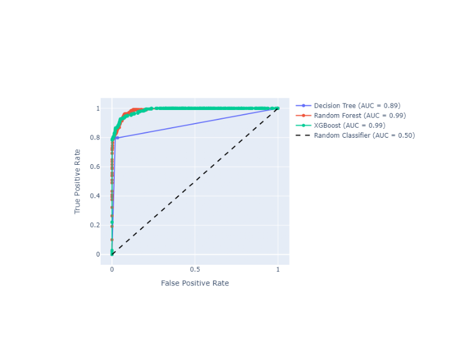

*****************************************************************************************
Receiver Operating Characteristic (ROC) Curve with Probabilities (Thresholds) Annotations
*****************************************************************************************

The ROC curve is a graphical plot that illustrates the diagnostic ability of a binary classifier system as its discrimination threshold is varied. It plots the True Positive Rate (TPR) against the False Positive Rate (FPR) at various threshold settings. The ROC curve is particularly useful when you have balanced classes or when you want to evaluate the classifier's performance across all possible thresholds.

.. autofunction:: ds_utils.metrics.curves.plot_roc_curve_with_thresholds_annotations

Code Example
============
Suppose that we want to compare 3 classifiers based on ROC Curve and optimize the prediction threshold. The method uses
Plotly as the backend engine to create the graphs and adds the AUC score next to each classifier name::

    from sklearn.tree import DecisionTreeClassifier
    from sklearn.ensemble import RandomForestClassifier
    from xgboost import XGBClassifier

    from ds_utils.metrics.curves import plot_roc_curve_with_thresholds_annotations

    # Define and train classifiers
    tree_clf = DecisionTreeClassifier(random_state=42)
    rf_clf = RandomForestClassifier(random_state=42)
    xgb_clf = XGBClassifier(random_state=42, eval_metric='logloss')

    tree_clf.fit(X_train, y_train)
    rf_clf.fit(X_train, y_train)
    xgb_clf.fit(X_train, y_train)

    # Prepare classifier predictions
    classifiers_names_and_scores_dict = {
        "Decision Tree": tree_clf.predict_proba(X_test)[:, 1],
        "Random Forest": rf_clf.predict_proba(X_test)[:, 1],
        "XGBoost": xgb_clf.predict_proba(X_test)[:, 1]
    }

    # Plot ROC curves
    fig = plot_roc_curve_with_thresholds_annotations(
        y_test,
        classifiers_names_and_scores_dict,
        positive_label=1
    )
    fig.show()

The `positive_label=1` parameter specifies which class should be considered as the positive class when calculating the ROC curve. In this case, it indicates that the class labeled as '1' is the positive class.

And the following interactive graph will be shown:

******************************************************************
Precision-Recall Curve with Probabilities (Thresholds) Annotations
******************************************************************

The Precision-Recall curve shows the tradeoff between precision and recall for different threshold values. It is particularly useful when you have imbalanced classes, as it focuses on the performance of the positive class. Precision-Recall curves are preferred over ROC curves when you have a large skew in the class distribution, as they are more sensitive to differences in the minority class.

.. autofunction:: ds_utils.metrics.curves.plot_precision_recall_curve_with_thresholds_annotations

Code Example
============
Suppose that we want to compare 3 classifiers based on Precision-Recall Curve and optimize the prediction threshold.
The method uses Plotly as the backend engine to create the graphs::

    from sklearn.tree import DecisionTreeClassifier
    from sklearn.ensemble import RandomForestClassifier
    from xgboost import XGBClassifier

    from ds_utils.metrics.curves import plot_precision_recall_curve_with_thresholds_annotations

    # Define and train classifiers
    tree_clf = DecisionTreeClassifier(random_state=42)
    rf_clf = RandomForestClassifier(random_state=42)
    xgb_clf = XGBClassifier(random_state=42, eval_metric='logloss')

    tree_clf.fit(X_train, y_train)
    rf_clf.fit(X_train, y_train)
    xgb_clf.fit(X_train, y_train)

    # Prepare classifier predictions
    classifiers_names_and_scores_dict = {
        "Decision Tree": tree_clf.predict_proba(X_test)[:, 1],
        "Random Forest": rf_clf.predict_proba(X_test)[:, 1],
        "XGBoost": xgb_clf.predict_proba(X_test)[:, 1]
    }

    # Plot Precision-Recall curves
    fig = plot_precision_recall_curve_with_thresholds_annotations(
        y_test,
        classifiers_names_and_scores_dict,
        positive_label=1
    )
    fig.show()

Similar to the ROC curve example, the `positive_label=1` parameter here specifies that the class labeled as '1' should be considered as the positive class when calculating the Precision-Recall curve.

And the following interactive graph will be shown:

.. image:: ../../../tests/baseline_images/test_metrics/test_curves/test_plot_precision_recall_curve_with_thresholds_annotations_default.png
    :align: center
    :alt: Precision-Recall Curve with Probabilities (Thresholds) Annotations
