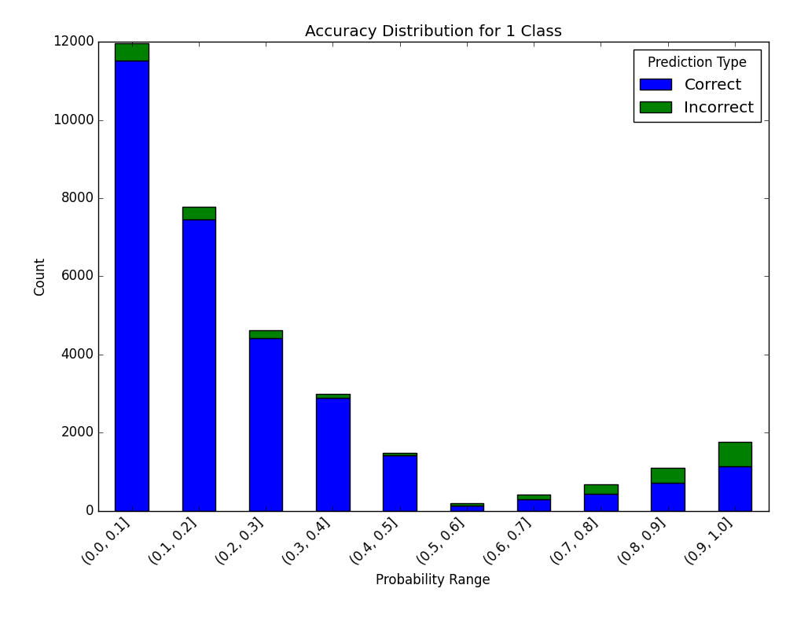

*****************************************
Visualize Accuracy Grouped by Probability
*****************************************
This method was created due to the lack of maintenance of the package `EthicalML / xai <https://github.com/EthicalML/XAI>`_.

.. autofunction:: ds_utils.metrics.probability_analysis.visualize_accuracy_grouped_by_probability

Code Example
============
The example uses a small sample from a dataset from
`kaggle <https://www.kaggle.com/mrferozi/loan-data-for-dummy-bank>`_, which a dummy bank provides loans.

Let's see how to use the code::

    from matplotlib import pyplot as plt
    from sklearn.ensemble import RandomForestClassifier

    from ds_utils.metrics.probability_analysis import visualize_accuracy_grouped_by_probability

    # Load and prepare the data
    loan_data = pandas.read_csv(path/to/dataset, encoding="latin1", nrows=11000,
                                parse_dates=["issue_d"])
    loan_data = loan_data.drop(["id", "application_type"], axis=1)
    loan_data = loan_data.sort_values("issue_d")
    loan_data = pandas.get_dummies(loan_data)

    # Prepare train and test sets
    train = (loan_data.head(int(loan_data.shape[0] * 0.7))
             .sample(frac=1)
             .reset_index(drop=True)
             .drop("issue_d", axis=1))
    test = loan_data.tail(int(loan_data.shape[0] * 0.3)).drop("issue_d", axis=1)

    # Define features to use for classification
    selected_features = [
        'emp_length_int', 'home_ownership_MORTGAGE', 'home_ownership_RENT',
        'income_category_Low', 'term_ 36 months', 'purpose_debt_consolidation',
        'purpose_small_business', 'interest_payments_High'
    ]

    # Train the classifier
    classifier = RandomForestClassifier(
        min_samples_leaf=int(train.shape[0] * 0.01),
        class_weight="balanced",
        n_estimators=1000,
        random_state=0
    )
    classifier.fit(train[selected_features], train["loan_condition_cat"])

    # Make predictions and visualize accuracy
    probabilities = classifier.predict_proba(test[selected_features])
    visualize_accuracy_grouped_by_probability(
        test["loan_condition_cat"],
        1,
        probabilities[:, 1],
        display_breakdown=False
    )

    plt.show()

And the following image will be shown:

.. image:: ../../../tests/baseline_images/test_metrics/test_probability_analysis/test_visualize_accuracy_grouped_by_probability_default.png
    :align: center
    :alt: Visualize Accuracy Grouped by Probability

If we choose to display the breakdown::

    visualize_accuracy_grouped_by_probability(
        test["loan_condition_cat"],
        1,
        probabilities[:, 1],
        display_breakdown=True
    )
    plt.show()

And the following image will be shown:

