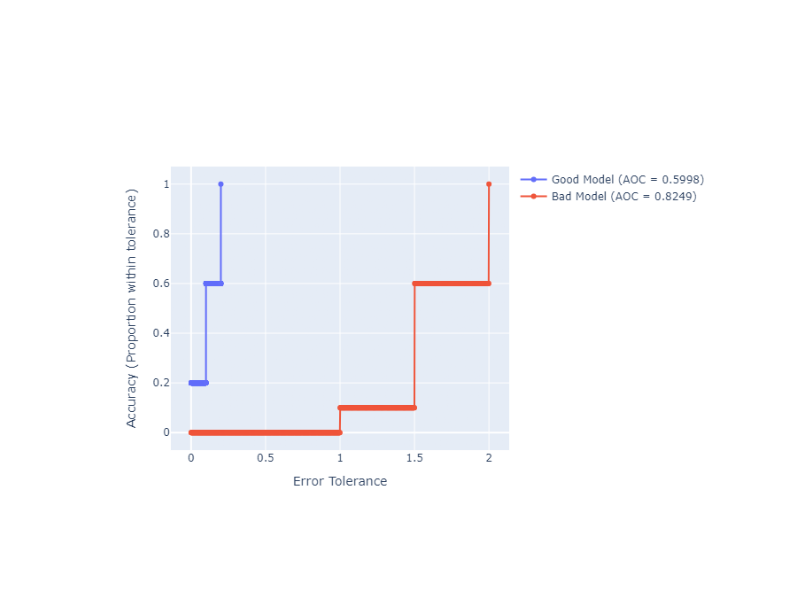

Regression Metrics
==================

Regression Error Characteristic (REC) curves provide a powerful framework for evaluating and comparing regression models, generalizing the Receiver Operating Characteristic (ROC) curve used in classification.

Background and Theory
-------------------

The REC curve was introduced by **Bi & Bennett (2003)** in *"Regression error characteristic curves"* (Proceedings of the Twentieth International Conference on Machine Learning, pp. 43-50) as a method to visualize the cumulative distribution of errors in regression modeling. 

Unlike classification where predictions are binary, regression predictions fall along a continuous scale. The REC curve handles this by plotting **Error Tolerance** on the x-axis against **Accuracy** on the y-axis. Here, "accuracy" is defined as the proportion of predictions that fall within the specified error tolerance.

This framework was further extended into the Regression ROC (RROC) space by **Hernández-Orallo (2013)** in *"ROC curves for regression"* (Pattern Recognition, 46(12), 3395-3411, doi:10.1016/j.patcog.2013.06.014). This work demonstrated that the area under/over the curve relates deeply to the variance and expected magnitude of regression errors.

### Interpreting the Area Over the Curve (AOC)

In classification ROC curves, a larger Area Under the Curve (AUC) is better. For REC curves, we look at the **Area Over the Curve (AOC)**:

* **0.0 is Perfect:** A perfect model has zero error for every prediction. Its REC curve jumps to 1.0 (100% accuracy) instantly at an error tolerance of 0, meaning there is zero area *over* the curve.
* **Lower is Better:** The smaller the AOC, the closer the predictions are to the true values.
* **Normalized Score:** The AOC is typically normalized by dividing by the maximum absolute error observed, yielding a bounded metric in [0, 1]. This makes it easier to compare performance across different datasets and scales.

Regression AUC Score
--------------------

.. autofunction:: ds_utils.metrics.regression.regression_auc_score

Code Example
~~~~~~~~~~~~

.. code-block:: python

    import numpy as np
    from ds_utils.metrics.regression import regression_auc_score

    # Generate dummy data
    y_true = np.array([1.0, 2.0, 3.0, 4.0, 5.0, 6.0, 7.0, 8.0, 9.0, 10.0])
    y_pred_good = np.array([1.1, 2.2, 2.8, 4.1, 5.0, 5.9, 7.2, 7.8, 9.1, 10.0])
    y_pred_bad = np.array([2.0, 3.5, 1.5, 5.5, 3.0, 8.0, 5.5, 9.5, 7.0, 12.0])

    # Calculate AOC scores (normalized)
    good_aoc = regression_auc_score(y_true, y_pred_good)
    bad_aoc = regression_auc_score(y_true, y_pred_bad)

    print(f"Good Model AOC: {good_aoc:.4f}")
    print(f"Bad Model AOC:  {bad_aoc:.4f}")

.. code-block:: text

    Output:
    Good Model AOC: 0.1000
    Bad Model AOC:  0.4200

Plot REC Curve with Annotations
-------------------------------

.. autofunction:: ds_utils.metrics.regression.plot_rec_curve_with_annotations

Code Example
~~~~~~~~~~~~

We can use the `plot_rec_curve_with_annotations` function to visually compare the two models from the previous example. The Plotly backend allows for interactive exploration of the error tolerances.

.. code-block:: python

    import numpy as np
    from ds_utils.metrics.regression import plot_rec_curve_with_annotations

    # Generate dummy data
    y_true = np.array([1.0, 2.0, 3.0, 4.0, 5.0, 6.0, 7.0, 8.0, 9.0, 10.0])
    predictions = {
        "Good Model": np.array([1.1, 2.2, 2.8, 4.1, 5.0, 5.9, 7.2, 7.8, 9.1, 10.0]),
        "Bad Model": np.array([2.0, 3.5, 1.5, 5.5, 3.0, 8.0, 5.5, 9.5, 7.0, 12.0]),
    }

    # Plot REC curves
    fig = plot_rec_curve_with_annotations(y_true, predictions)
    fig.show()

And the following interactive graph will be shown:

