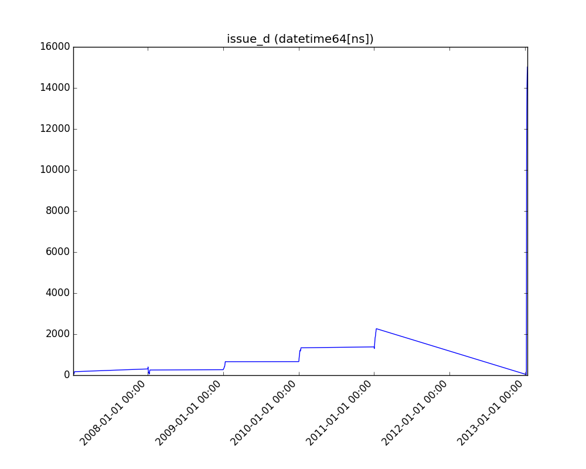
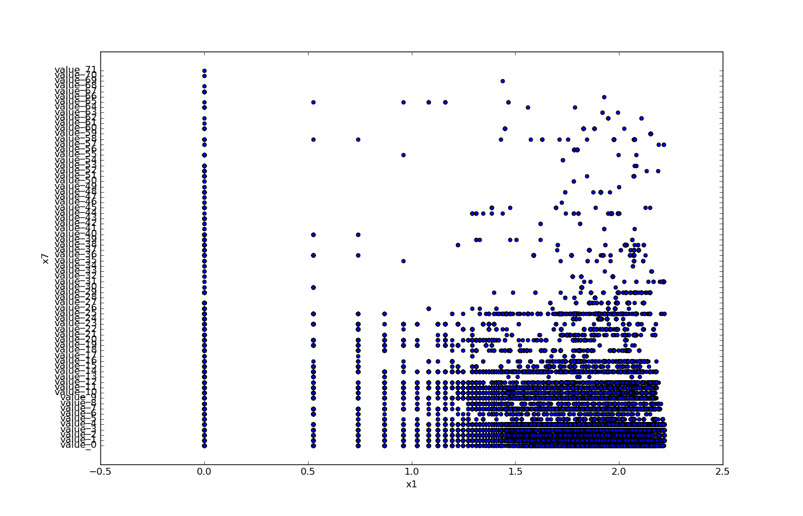
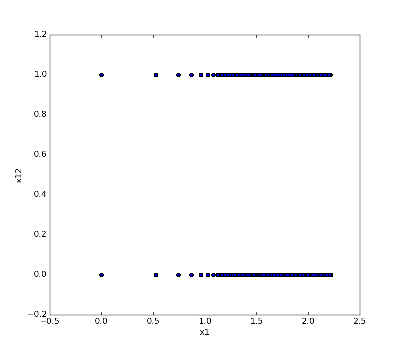
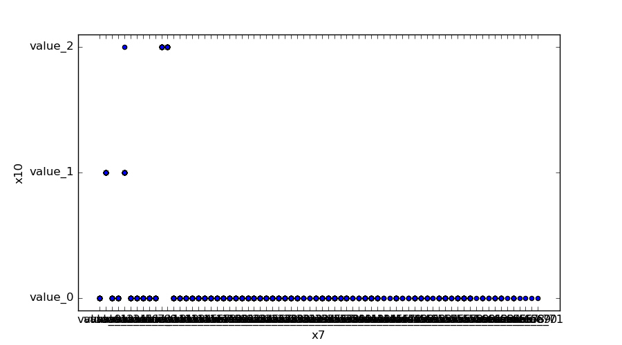
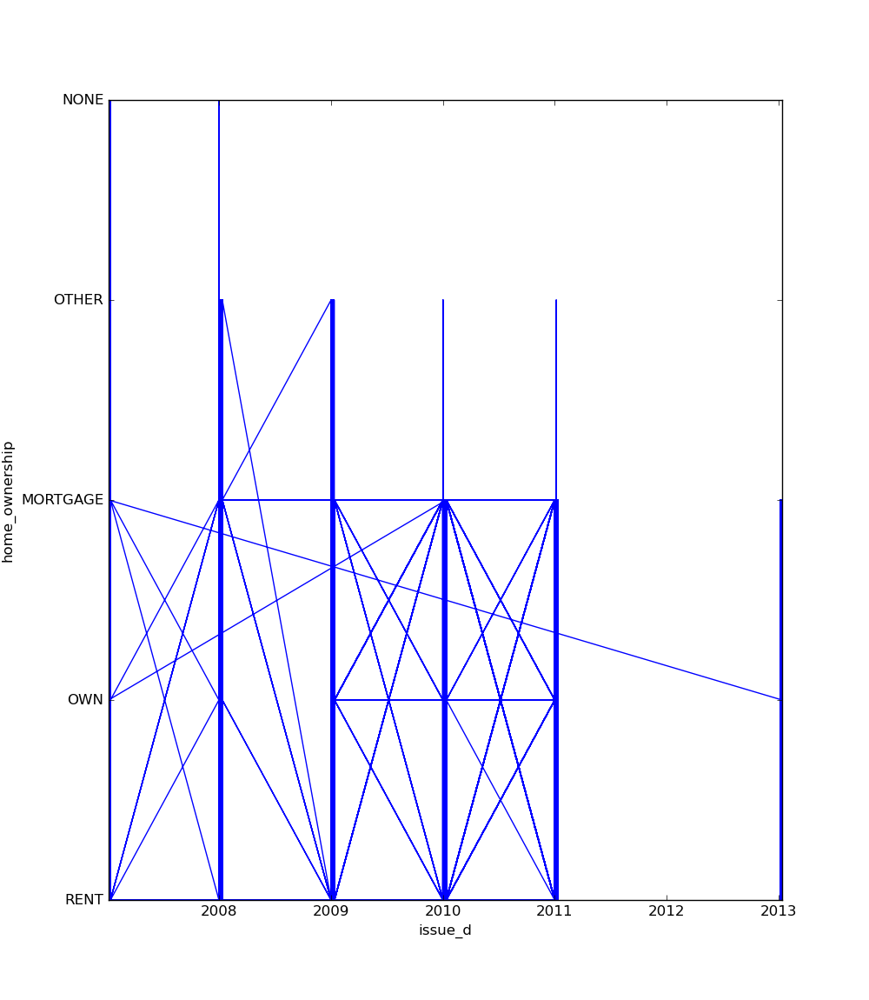
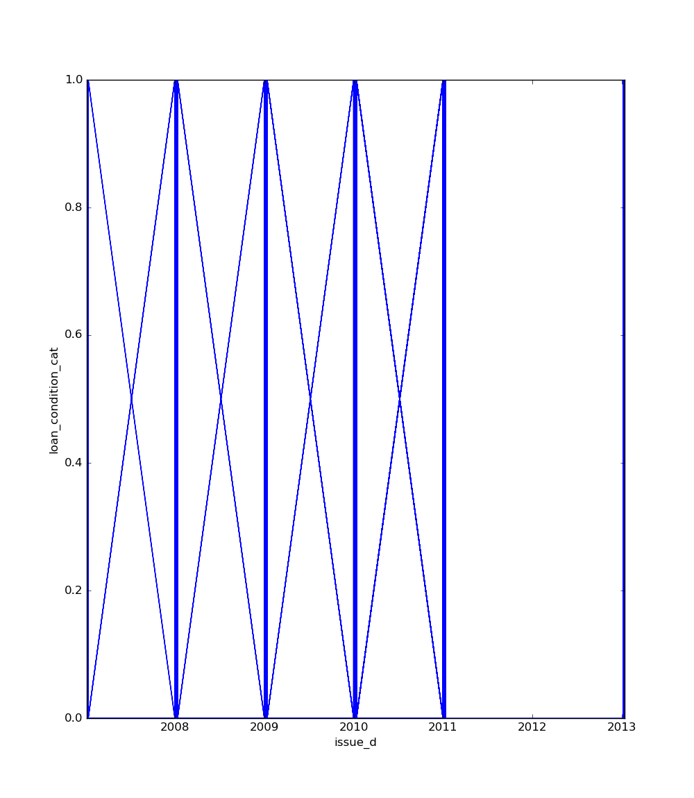

##########
Preprocess
##########
The preprocess module contains methods for data preprocessing before training. These visualization tools help in understanding the structure and relationships within your data, which is crucial for effective feature engineering and model selection.

*****************
Visualize Feature
*****************
This method provides a quick visualization of individual features, offering insights into their distribution and characteristics. Use this when you want to:

- Understand the distribution of numerical features
- Identify the most common categories in categorical features
- Observe trends in time series data
- Detect potential outliers or unusual patterns

These insights can guide feature engineering, help in identifying data quality issues, and inform the choice of preprocessing steps or model types.

.. autofunction:: preprocess::visualize_feature

Code Example
============
This example uses a small sample from a dataset available on `Kaggle <https://www.kaggle.com/mrferozi/loan-data-for-dummy-bank>`_, which contains loan data from a dummy bank.

Here's how to use the code::

    import pandas as pd
    from matplotlib import pyplot as plt
    from ds_utils.preprocess import visualize_feature

    loan_frame = pd.read_csv('path/to/dataset', encoding="latin1", nrows=11000, parse_dates=["issue_d"])
    loan_frame = loan_frame.drop("id", axis=1)

    visualize_feature(loan_frame["some_feature"])

    plt.show()

For each different type of feature, a different graph will be generated:

Float
-----
A distribution plot is shown:

Datetime Series
---------------
A line plot is shown:

Object, Categorical, Boolean or Integer
---------------------------------------
A count plot is shown.

Categorical / Object:

If the categorical / object feature has more than 10 unique values, the 10 most common values are shown, and
the others are labeled "Other Values".

Boolean:

Integer:

Looping Over All the Features
-----------------------------
This code example shows how to construct a loop to visualize all features::

    import pandas as pd
    from matplotlib import pyplot as plt
    from ds_utils.preprocess import visualize_feature

    loan_frame = pd.read_csv('path/to/dataset', encoding="latin1", nrows=11000, parse_dates=["issue_d"])
    loan_frame = loan_frame.drop("id", axis=1)

    fig, axes = plt.subplots(5, 2, figsize=(18, 30))
    axes = axes.flatten()

    for i, feature in enumerate(loan_frame.columns):
        if i < len(axes):
            visualize_feature(loan_frame[feature], ax=axes[i])

    fig.delaxes(axes[9])
    plt.subplots_adjust(hspace=0.5)
    plt.show()

The following image will be shown:

.. image:: images/loop_visualize_feature_example.png
    :align: center
    :alt: Features Visualization

***********************
Get Correlated Features
***********************

This function identifies highly correlated features in your dataset. Use this when you want to:

- Detect multi-collinearity in your feature set
- Simplify your model by removing redundant features
- Understand the relationship between features and the target variable

Insights from this analysis can help in feature selection, reducing overfitting, and improving model interpretability.

.. autofunction:: preprocess::get_correlated_features

Code Example
============
This example uses a small sample from a dataset available on `Kaggle <https://www.kaggle.com/mrferozi/loan-data-for-dummy-bank>`_, which contains loan data from a dummy bank.

Here's how to use the code::

    import pandas as pd
    from ds_utils.preprocess import get_correlated_features

    loan_frame = pd.read_csv('path/to/dataset', encoding="latin1", nrows=30)
    target = "loan_condition_cat"
    features = loan_frame.columns.drop(["loan_condition_cat", "issue_d", "application_type"]).tolist()
    correlations = get_correlated_features(pd.get_dummies(loan_frame), features, target)
    print(correlations)

The following table will be the output:

+----------------------+----------------------+--------------------+-------------------+-------------------+
|level_0               |level_1               |level_0_level_1_corr|level_0_target_corr|level_1_target_corr|
+======================+======================+====================+===================+===================+
|income_category_Low   |income_category_Medium|1.0                 |0.1182165609358650 |0.11821656093586504|
+----------------------+----------------------+--------------------+-------------------+-------------------+
|term\_ 36 months      |term\_ 60 months      |1.0                 |0.1182165609358650 |0.11821656093586504|
+----------------------+----------------------+--------------------+-------------------+-------------------+
|interest_payments_High|interest_payments_Low |1.0                 |0.1182165609358650 |0.11821656093586504|
+----------------------+----------------------+--------------------+-------------------+-------------------+

**********************
Visualize Correlations
**********************
This method provides a heatmap visualization of feature correlations. Use this when you want to:

- Get an overview of relationships between all features in your dataset
- Identify clusters of highly correlated features
- Spot potential redundancies in your feature set

This visualization can guide feature selection, help in understanding feature interactions, and inform feature engineering strategies.

.. autofunction:: preprocess::visualize_correlations

Code Example
============
For this example, a dummy dataset was created. You can find the data in the resources directory in the package's tests folder.

Here's how to use the code::

    import pandas as pd
    from matplotlib import pyplot as plt
    from ds_utils.preprocess import visualize_correlations

    data_1M = pd.read_csv('path/to/dataset')
    visualize_correlations(data_1M)
    plt.show()

The following image will be shown:

***************************
Plot Correlation Dendrogram
***************************
This method creates a hierarchical clustering of features based on their correlations. Use this when you want to:

- Visualize the hierarchical structure of feature relationships
- Identify groups of features that are closely related
- Guide feature selection by choosing representatives from each cluster

This visualization is particularly useful for high-dimensional datasets, helping to simplify complex feature spaces and inform dimensionality reduction strategies.

.. autofunction:: preprocess::plot_correlation_dendrogram

Code Example
============

For this example, a dummy dataset was created. You can find the data in the resources directory in the package's tests folder.

Here's how to use the code::

    import pandas as pd
    from matplotlib import pyplot as plt
    from ds_utils.preprocess import plot_correlation_dendrogram

    data_1M = pd.read_csv('path/to/dataset')
    plot_correlation_dendrogram(data_1M)
    plt.show()

The following image will be shown:

**************************
Plot Features' Interaction
**************************
This method visualizes the relationship between two features. Use this when you want to:

- Understand how two features interact or relate to each other
- Identify potential non-linear relationships between features
- Detect patterns, clusters, or outliers in feature pairs

These insights can guide feature engineering, help in identifying complex relationships that might be exploited by your model, and inform the choice of model type (e.g., linear vs. non-linear).

.. autofunction:: preprocess::plot_features_interaction

Code Example
============
For this example, a dummy dataset was created. You can find the data in the resources directory in the package's tests folder.

Here's how to use the code::

    import pandas as pd
    from matplotlib import pyplot as plt
    from ds_utils.preprocess import plot_features_interaction

    data_1M = pd.read_csv('path/to/dataset')
    plot_features_interaction("x7", "x10", data_1M)
    plt.show()

For each different combination of feature types, a different plot will be shown:

Both Features are Numeric
-------------------------
A scatter plot of the shared distribution is shown:

One Feature is Numeric and The Other is Categorical
---------------------------------------------------
If one feature is numeric and the other is either an ``object``, a ``category``, or a ``bool``, then a box
plot is shown. The plot displays the distribution of the numeric feature for each unique value of the categorical feature. If the categorical feature has more than 10 unique values, then the 10 most common values are shown, and
the others are labeled "Other Values".

Here is an example for a boolean feature plot:

Both Features are Categorical
-----------------------------
A shared histogram will be shown. If one or both features have more than 10 unique values, then the 10 most common
values are shown, and the others are labeled "Other Values".

One Feature is Datetime Series and the Other is Numeric or Datetime Series
--------------------------------------------------------------------------
A line plot where the datetime series is on the x-axis is shown:

One Feature is Datetime Series and the Other is Categorical
-----------------------------------------------------------
If one feature is a datetime series and the other is either an ``object``, a ``category``, or a ``bool``, then a
violin plot is shown. A violin plot is a combination of a boxplot and a kernel density estimate. If the categorical feature
has more than 10 unique values, then the 10 most common values are shown, and the others are labeled "Other Values". The
datetime series will be on the x-axis:

Here is an example for a boolean feature plot:

Looping One Feature over The Others
-----------------------------------
This code example shows how to construct a loop to display the relationship of one feature with all the others::

    import pandas as pd
    from matplotlib import pyplot as plt
    from ds_utils.preprocess import plot_features_interaction

    data_1M = pd.read_csv('path/to/dataset')

    fig, axes = plt.subplots(6, 2, figsize=(16, 25))
    axes = axes.flatten()

    feature_1 = "x1"
    other_features = ["x2", "x3", "x4", "x5", "x6", "x7", "x8", "x9", "x10", "x11", "x12"]

    for i, feature in enumerate(other_features):
        if i < len(axes):
            axes[i].set_title(f"{feature_1} vs. {feature}")
            plot_features_interaction(feature_1, feature, data_1M, ax=axes[i])

    fig.delaxes(axes[11])
    fig.subplots_adjust(hspace=0.7)
    plt.show()

The following image will be shown:

.. image:: images/loop_plot_features_relationship_example.png
    :align: center
    :alt: Looping One Feature over The Others

Choosing the Right Visualization
================================
- Use `visualize_feature` for a quick overview of individual features.
- Use `get_correlated_features` and `visualize_correlations` to understand relationships between multiple features.
- Use `plot_correlation_dendrogram` for a hierarchical view of feature relationships, especially useful for high-dimensional data.
- Use `plot_features_interaction` to deep dive into the relationship between specific feature pairs.

By combining these visualizations, you can gain a comprehensive understanding of your dataset's structure, which is crucial for effective data preprocessing, feature engineering, and model selection.

**************************************
Extract Statistics DataFrame per Label
**************************************

.. autofunction:: preprocess::extract_statistics_dataframe_per_label

Code Example
============
See the following code example of usage::

    import pandas as pd

    from ds_utils.preprocess import extract_statistics_dataframe_per_label

