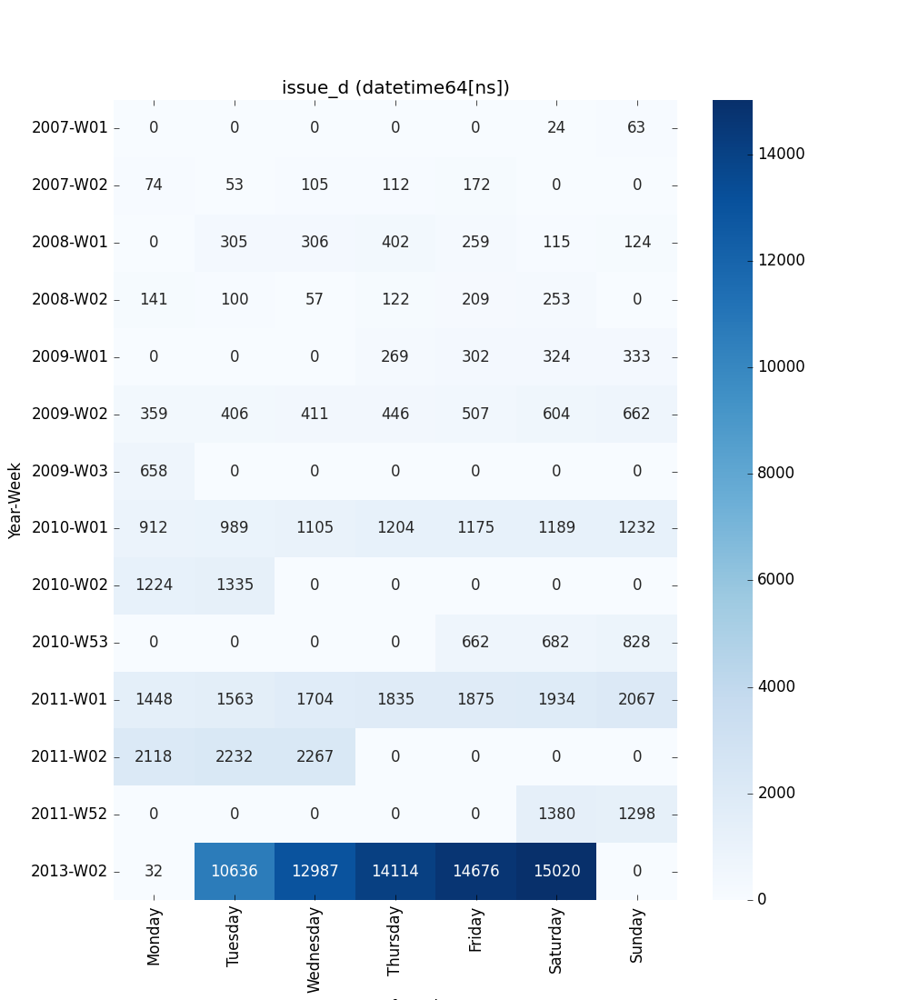

#############
Visualization
#############

The visualization submodule contains methods for visualizing features and their relationships.

*****************
Visualize Feature
*****************

This method provides a quick visualization of individual features, offering insights
into their distribution and characteristics. Use this when you want to:

- Understand the distribution of numerical features
- Identify the most common categories in categorical features
- Observe trends in time series data
- Detect potential outliers or unusual patterns

These insights can guide feature engineering, help in identifying data quality issues,
and inform the choice of preprocessing steps or model types.

.. autofunction:: ds_utils.preprocess.visualization.visualize_feature

Code Example
============

This example uses a small sample from a dataset available on
`Kaggle <https://www.kaggle.com/mrferozi/loan-data-for-dummy-bank>`_,
which contains loan data from a dummy bank.

.. code-block:: python

    import pandas as pd
    from matplotlib import pyplot as plt
    from ds_utils.preprocess.visualization import visualize_feature

    loan_frame = pd.read_csv(
        'path/to/dataset',
        encoding="latin1",
        nrows=11000,
        parse_dates=["issue_d"]
    )
    loan_frame = loan_frame.drop("id", axis=1)

    # Basic usage
    visualize_feature(loan_frame["some_feature"])

    # Handle NA values (removes them before plotting)
    visualize_feature(loan_frame["feature_with_nas"], remove_na=True)

    # For float features, control outliers
    visualize_feature(
        loan_frame["float_feature"],
        include_outliers=False,
        outlier_iqr_multiplier=1.5
    )

    # For datetime features, customize week start
    visualize_feature(loan_frame["datetime_feature"], first_day_of_week="Sunday")

    # For categorical / object / boolean / int, customize order and counts
    visualize_feature(loan_frame["category_feature"], show_counts=False)          # hide count labels
    visualize_feature(loan_frame["category_feature"], order="count_desc")        # sort by descending count
    visualize_feature(loan_frame["category_feature"], order=["High", "Medium", "Low"])  # explicit order

    plt.show()

Handling Missing Values
-----------------------
By default (`remove_na=False`), missing values are handled based on the feature type:

- **Float & Datetime**: Missing values are automatically dropped before plotting, as these plots require valid numerical/time data.
- **Categorical / Object / Boolean / Integer**: Missing values are included in the count and displayed as a separate bar/category (if any exist).

To explicitly exclude missing values from categorical plots, set `remove_na=True`.

For each different type of feature a different graph will be generated:

Float
-----

A violin plot is shown:

.. image:: ../../../tests/baseline_images/test_preprocess/test_visualization/test_visualize_feature_float_datetime_int_float.png
   :align: center
   :alt: Visualize Feature Float

Datetime Series
---------------

Datetime features are visualized as a 2-D heatmap that shows weekly patterns:

- **X-axis** - Day of the week (configurable first day via ``first_day_of_week``)
- **Y-axis** - Year-week (e.g., ``2024-W52``, ``2025-W01``)
- **Cell values** - Count of records for that day/week (numbers are annotated)

Default (week starts on Monday):

Object, Categorical, Boolean or Integer
---------------------------------------

A count plot is shown.

**Categorical / Object**

If the categorical / object feature has more than 10 unique values, the 10 most common
values are shown and the rest are labelled “Other Values”. Use the ``order`` parameter
to control sorting (e.g., ``"count_desc"`` or a list of category names).

.. image:: ../../../tests/baseline_images/test_preprocess/test_visualization/test_visualize_feature_object_category_more_than_10_categories_show_counts.png
   :align: center
   :alt: Visualize Feature Categorical

**Boolean**

.. image:: ../../../tests/baseline_images/test_preprocess/test_visualization/test_visualize_feature_bool_show_counts.png
   :align: center
   :alt: Visualize Feature Boolean

**Integer**

.. image:: ../../../tests/baseline_images/test_preprocess/test_visualization/test_visualize_feature_float_datetime_int_int.png
   :align: center
   :alt: Visualize Feature Integer

 

**********************
Visualize Correlations
**********************
This method provides a heatmap visualization of feature correlations. Use this when you want to:

- Get an overview of relationships between all features in your dataset
- Identify clusters of highly correlated features
- Spot potential redundancies in your feature set

This visualization can guide feature selection, help in understanding feature interactions, and inform feature engineering strategies.

.. autofunction:: ds_utils.preprocess.visualization.visualize_correlations

Code Example
============
For this example, a dummy dataset was created. You can find the data in the resources directory in the package's tests folder.

Here's how to use the code::

    import pandas as pd
    from matplotlib import pyplot as plt
    from ds_utils.preprocess.visualization import visualize_correlations

    data_1M = pd.read_csv('path/to/dataset')
    visualize_correlations(data_1M.corr())
    plt.show()

The following image will be shown:

.. image:: ../../../tests/baseline_images/test_preprocess/test_visualization/test_visualize_correlations_default.png
    :align: center
    :alt: Features Correlations

***************************
Plot Correlation Dendrogram
***************************
This method creates a hierarchical clustering of features based on their correlations. Use this when you want to:

- Visualize the hierarchical structure of feature relationships
- Identify groups of features that are closely related
- Guide feature selection by choosing representatives from each cluster

This visualization is particularly useful for high-dimensional datasets, helping to simplify complex feature spaces and inform dimensionality reduction strategies.

.. autofunction:: ds_utils.preprocess.visualization.plot_correlation_dendrogram

Code Example
============

For this example, a dummy dataset was created. You can find the data in the resources directory in the package's tests folder.

Here's how to use the code::

    import pandas as pd
    from matplotlib import pyplot as plt
    from ds_utils.preprocess.visualization import plot_correlation_dendrogram

    data_1M = pd.read_csv('path/to/dataset')
    plot_correlation_dendrogram(data_1M.corr())
    plt.show()

The following image will be shown:

.. image:: ../../../tests/baseline_images/test_preprocess/test_visualization/test_plot_correlation_dendrogram_default.png
    :align: center
    :alt: Plot Correlation Dendrogram

**************************
Plot Features' Interaction
**************************
This method visualizes the relationship between two features. Use this when you want to:

- Understand how two features interact or relate to each other
- Identify potential non-linear relationships between features
- Detect patterns, clusters, or outliers in feature pairs

Handling Missing Values
=======================
By default (`remove_na=False`), the function visualizes missing values (NaNs/NaTs) to prevent data loss in the visual analysis:

- **Numeric & Datetime**: Missing values in one variable are plotted as rug marks or special markers along the axis of the valid variable. This allows you to see the distribution of the valid data even when the other variable is missing.
- **Categorical**: Missing values are treated as a distinct category (e.g., "nan").

These insights can guide feature engineering, help in identifying complex relationships that might be exploited by your model, and inform the choice of model type (e.g., linear vs. non-linear).

.. autofunction:: ds_utils.preprocess.visualization.plot_features_interaction

Code Example
============
For this example, a dummy dataset was created. You can find the data in the resources directory in the package's tests folder.

Here's how to use the code::

    import pandas as pd
    from matplotlib import pyplot as plt
    from ds_utils.preprocess.visualization import plot_features_interaction

    data_1M = pd.read_csv('path/to/dataset')
    plot_features_interaction(data_1M, "x7", "x10")
    plt.show()

For each different combination of feature types, a different plot will be shown:

Both Features are Numeric
-------------------------
A scatter plot of the shared distribution is shown:

.. image:: ../../../tests/baseline_images/test_preprocess/test_visualization/test_plot_relationship_between_features_both_numeric.png
    :align: center
    :alt: Both Features are Numeric

One Feature is Numeric and The Other is Categorical
---------------------------------------------------
If one feature is numeric and the other is either an ``object``, a ``category``, or a ``bool``, then a violin plot
is shown. A violin plot combines a box plot with a kernel density estimate, displaying the distribution of the numeric feature for each unique value of the categorical feature. If the categorical feature has more than 10 unique values, then the 10 most common values are shown, and
the others are labeled "Other Values".

.. image:: ../../../tests/baseline_images/test_preprocess/test_visualization/test_plot_relationship_between_features_numeric_categorical.png
    :align: center
    :alt: Numeric and Categorical

Here is an example for a boolean feature plot:

.. image:: ../../../tests/baseline_images/test_preprocess/test_visualization/test_plot_relationship_between_features_numeric_boolean.png
    :align: center
    :alt: Numeric and Boolean

Both Features are Categorical
-----------------------------
A shared histogram will be shown. If one or both features have more than 10 unique values, then the 10 most common
values are shown, and the others are labeled "Other Values".

.. image:: ../../../tests/baseline_images/test_preprocess/test_visualization/test_plot_relationship_between_features_both_categorical.png
    :align: center
    :alt: Both Features are Categorical

One Feature is Datetime Series and the Other is Numeric or Datetime Series
--------------------------------------------------------------------------
A line plot where the datetime series is on the x-axis is shown:

.. image:: ../../../tests/baseline_images/test_preprocess/test_visualization/test_plot_relationship_between_features_datetime_numeric.png
    :align: center
    :alt: One Feature is Datetime Series and the other is Numeric or Datetime Series

One Feature is Datetime Series and the Other is Categorical
-----------------------------------------------------------
If one feature is a datetime series and the other is either an ``object``, a ``category``, or a ``bool``, then a
violin plot is shown. A violin plot is a combination of a boxplot and a kernel density estimate. If the categorical feature
has more than 10 unique values, then the 10 most common values are shown, and the others are labeled "Other Values". The
datetime series will be on the x-axis:

.. image:: ../../../tests/baseline_images/test_preprocess/test_visualization/test_plot_relationship_between_features_datetime_categorical.png
    :align: center
    :alt: Datetime Series and Categorical

Here is an example for a boolean feature plot:

.. image:: ../../../tests/baseline_images/test_preprocess/test_visualization/test_plot_relationship_between_features_datetime_bool_default.png
    :align: center
    :alt: Datetime Series and Boolean

Choosing the Right Visualization
================================
- Use `visualize_feature` for a quick overview of individual features.
- Use `get_correlated_features` and `visualize_correlations` to understand relationships between multiple features.
- Use `plot_correlation_dendrogram` for a hierarchical view of feature relationships, especially useful for high-dimensional data.
- Use `plot_features_interaction` to deep dive into the relationship between specific feature pairs.

By combining these visualizations, you can gain a comprehensive understanding of your dataset's structure, which is crucial for effective data preprocessing, feature engineering, and model selection.
