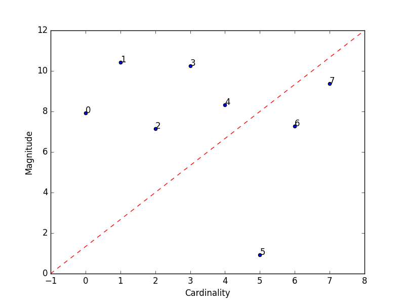

############
Unsupervised
############

The module of unsupervised contains methods that calculate and/or visualize evaluation performance of an unsupervised
model.

Mostly inspired by the Interpet Results of Cluster in Google's Machine Learning Crash Course. See more information
`here <https://developers.google.com/machine-learning/clustering/interpret>`_

************************
Plot Cluster Cardinality
************************

.. autofunction:: unsupervised::plot_cluster_cardinality

.. highlight:: python

In following examples we are going to use the iris dataset from scikit-learn. so firstly let's import it::

    from sklearn import datasets

    iris = datasets.load_iris()
    x = iris.data

We'll create a simple K-Means algorithm with k=8 and plot how many point goes to each cluster::

    from matplotlib import pyplot as plt
    from sklearn.cluster import KMeans

    from ds_utils.unsupervised import plot_cluster_cardinality

    estimator = KMeans(n_clusters=8, random_state=42)
    estimator.fit(x)

    plot_cluster_cardinality(estimator.labels_)

    plt.show()

And the following image will be shown:

.. image:: ../../tests/baseline_images/test_unsupervised/test_cluster_cardinality.png
    :align: center
    :alt: Cluster Cardinality

**********************
Plot Cluster Magnitude
**********************

.. autofunction:: unsupervised::plot_cluster_magnitude

Again we'll create a simple K-Means algorithm with k=8. This time we'll plot the sum of distances from points to their
centroid::

    from matplotlib import pyplot as plt
    from sklearn.cluster import KMeans
    from scipy.spatial.distance import euclidean

    from ds_utils.unsupervised import plot_cluster_magnitude

    estimator = KMeans(n_clusters=8, random_state=42)
    estimator.fit(x)

    plot_cluster_magnitude(x, estimator.labels_, estimator.cluster_centers_, euclidean)

    plt.show()

And the following image will be shown:

.. image:: ../../tests/baseline_images/test_unsupervised/test_plot_cluster_magnitude.png
    :align: center
    :alt: Plot Cluster Magnitude

*************************
Magnitude vs. Cardinality
*************************

.. autofunction:: unsupervised::plot_magnitude_vs_cardinality

Now let's plot the Cardinality vs. the Magnitude::

    from matplotlib import pyplot as plt
    from sklearn.cluster import KMeans
    from scipy.spatial.distance import euclidean

    from ds_utils.unsupervised import plot_magnitude_vs_cardinality

    estimator = KMeans(n_clusters=8, random_state=42)
    estimator.fit(x)

    plot_magnitude_vs_cardinality(x, estimator.labels_, estimator.cluster_centers_, euclidean)

    plt.show()

And the following image will be shown:

**************************
Optimum Number of Clusters
**************************

.. autofunction:: unsupervised::plot_loss_vs_cluster_number

Final plot we ca use is Loss vs Cluster Number::

    from matplotlib import pyplot as plt
    from scipy.spatial.distance import euclidean

    from ds_utils.unsupervised import plot_loss_vs_cluster_number

    plot_loss_vs_cluster_number(x, 3, 20, euclidean)

    plt.show()

And the following image will be shown:

.. image:: ../../tests/baseline_images/test_unsupervised/test_plot_loss_vs_cluster_number.png
    :align: center
    :alt: Optimum Number of Clusters
