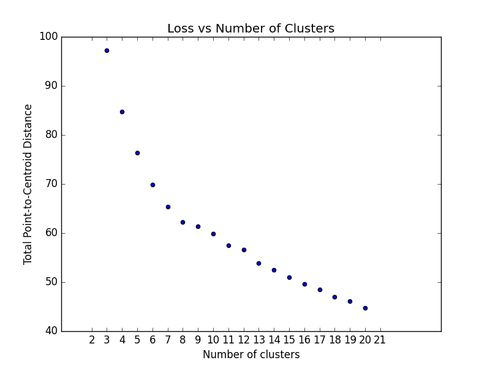

############
Unsupervised
############

The unsupervised module contains methods for calculating and visualizing evaluation performance of unsupervised
models. These tools are primarily inspired by concepts covered in Google's Machine Learning Crash Course,
particularly related to clustering. For more information on clustering, see the
`Google ML Glossary on Clustering <https://developers.google.com/machine-learning/glossary/clustering>`_.

************************
Plot Cluster Cardinality
************************

The plot_cluster_cardinality function visualizes the number of points in each cluster, which can help identify imbalanced clusters or outliers.

<<<<<<< HEAD
.. autofunction:: ds_utils.unsupervised.plot_cluster_cardinality
=======
.. autofunction:: unsupervised::plot_cluster_cardinality
>>>>>>> origin/master

.. highlight:: python

In the following example, we'll use the iris dataset from scikit-learn and create a simple K-Means algorithm with k=8 to plot how many points go to each cluster::

    from matplotlib import pyplot as plt
    from sklearn.cluster import KMeans
    from ds_utils.unsupervised import plot_cluster_cardinality

    # Create and fit the K-Means model
    estimator = KMeans(n_clusters=8, random_state=42)
    estimator.fit(X)

    # Plot the cluster cardinality
    plot_cluster_cardinality(estimator.labels_)
    plt.show()

And the following image will be shown:

.. image:: ../../tests/baseline_images/test_unsupervised/test_cluster_cardinality.png
    :align: center
    :alt: Cluster Cardinality

**********************
Plot Cluster Magnitude
**********************

The plot_cluster_magnitude function visualizes the total point-to-centroid distance for each cluster, which can help
identify compact or dispersed clusters.

<<<<<<< HEAD
.. autofunction:: ds_utils.unsupervised.plot_cluster_magnitude
=======
.. autofunction:: unsupervised::plot_cluster_magnitude
>>>>>>> origin/master

Here's an example of how to use the plot_cluster_magnitude function::

    from matplotlib import pyplot as plt
    from sklearn.cluster import KMeans
    from scipy.spatial.distance import euclidean
    from ds_utils.unsupervised import plot_cluster_magnitude

    # Create and fit the K-Means model
    estimator = KMeans(n_clusters=8, random_state=42)
    estimator.fit(X)

    #Plot the cluster magnitude
    plot_cluster_magnitude(X, estimator.labels_, estimator.cluster_centers_, euclidean)
    plt.show()

And the following image will be shown:

.. image:: ../../tests/baseline_images/test_unsupervised/test_plot_cluster_magnitude.png
    :align: center
    :alt: Plot Cluster Magnitude

*************************
Magnitude vs. Cardinality
*************************

The plot_magnitude_vs_cardinality function creates a scatter plot of cluster magnitude against cardinality, which can help identify anomalous clusters.

<<<<<<< HEAD
.. autofunction:: ds_utils.unsupervised.plot_magnitude_vs_cardinality
=======
.. autofunction:: unsupervised::plot_magnitude_vs_cardinality
>>>>>>> origin/master

Here's how to use the plot_magnitude_vs_cardinality function::

    from matplotlib import pyplot as plt
    from sklearn.cluster import KMeans
    from scipy.spatial.distance import euclidean
    from ds_utils.unsupervised import plot_magnitude_vs_cardinality

    # Create and fit the K-Means model
    estimator = KMeans(n_clusters=8, random_state=42)
    estimator.fit(X)

    # Plot magnitude vs. cardinality
    plot_magnitude_vs_cardinality(X, estimator.labels_, estimator.cluster_centers_, euclidean)
    plt.show()

And the following image will be shown:

.. image:: ../../tests/baseline_images/test_unsupervised/test_plot_magnitude_vs_cardinality.png
    :align: center
    :alt: Magnitude vs. Cardinality

**************************
Optimum Number of Clusters
**************************
The plot_loss_vs_cluster_number function helps determine the optimal number of clusters by plotting the total magnitude (sum of distances) as loss against the number of clusters.

<<<<<<< HEAD
.. autofunction:: ds_utils.unsupervised.plot_loss_vs_cluster_number
=======
.. autofunction:: unsupervised::plot_loss_vs_cluster_number
>>>>>>> origin/master

Here's an example of how to use the plot_loss_vs_cluster_number function::

    from matplotlib import pyplot as plt
    from scipy.spatial.distance import euclidean
    from ds_utils.unsupervised import plot_loss_vs_cluster_number

    # Plot loss vs. number of clusters
    plot_loss_vs_cluster_number(X, 3, 20, euclidean)
    plt.show()

And the following image will be shown:

