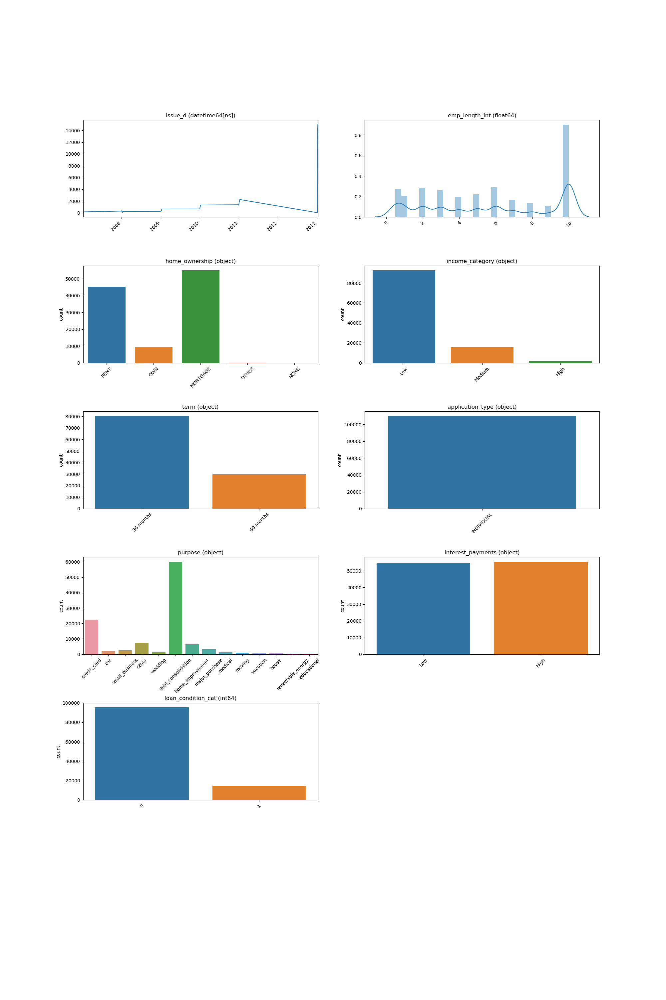
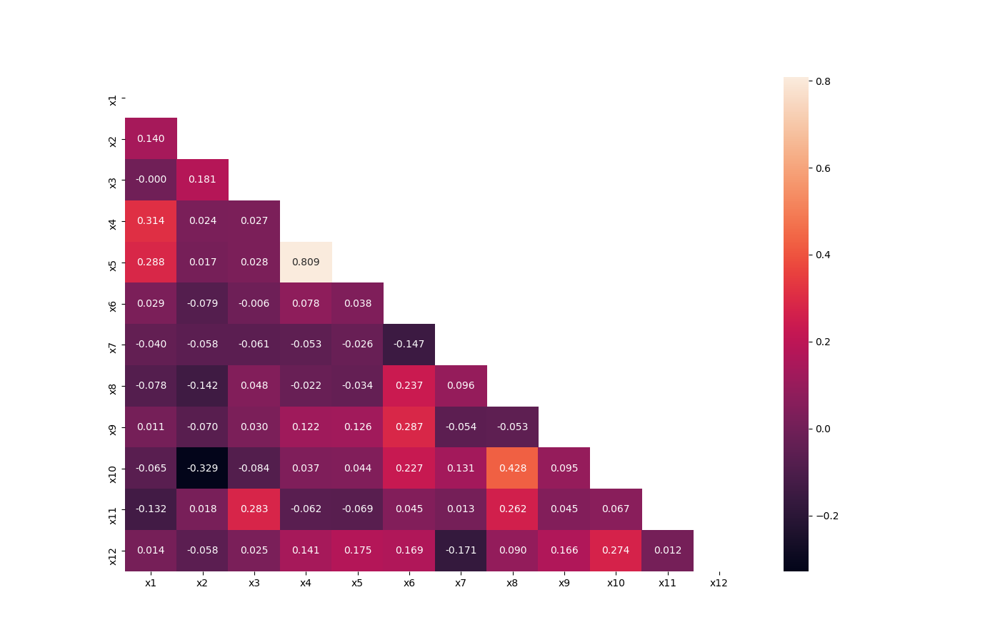
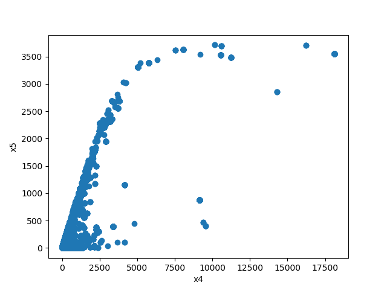
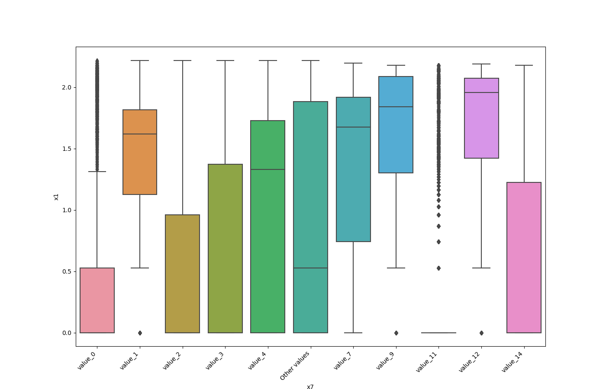
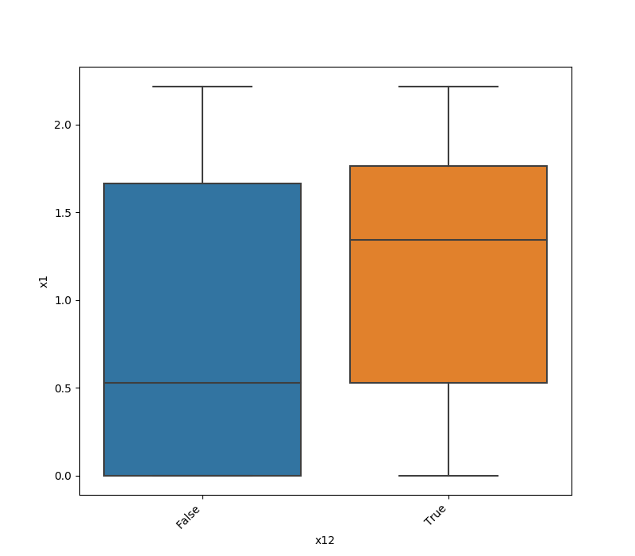
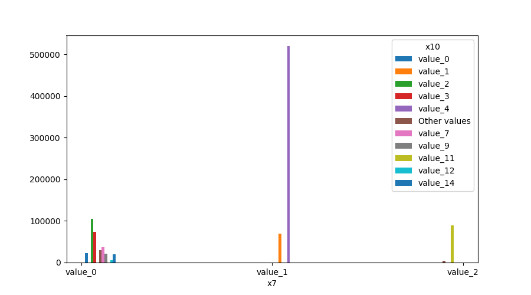
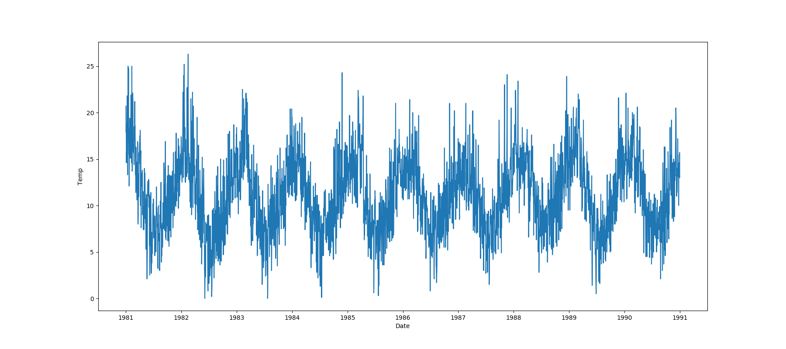
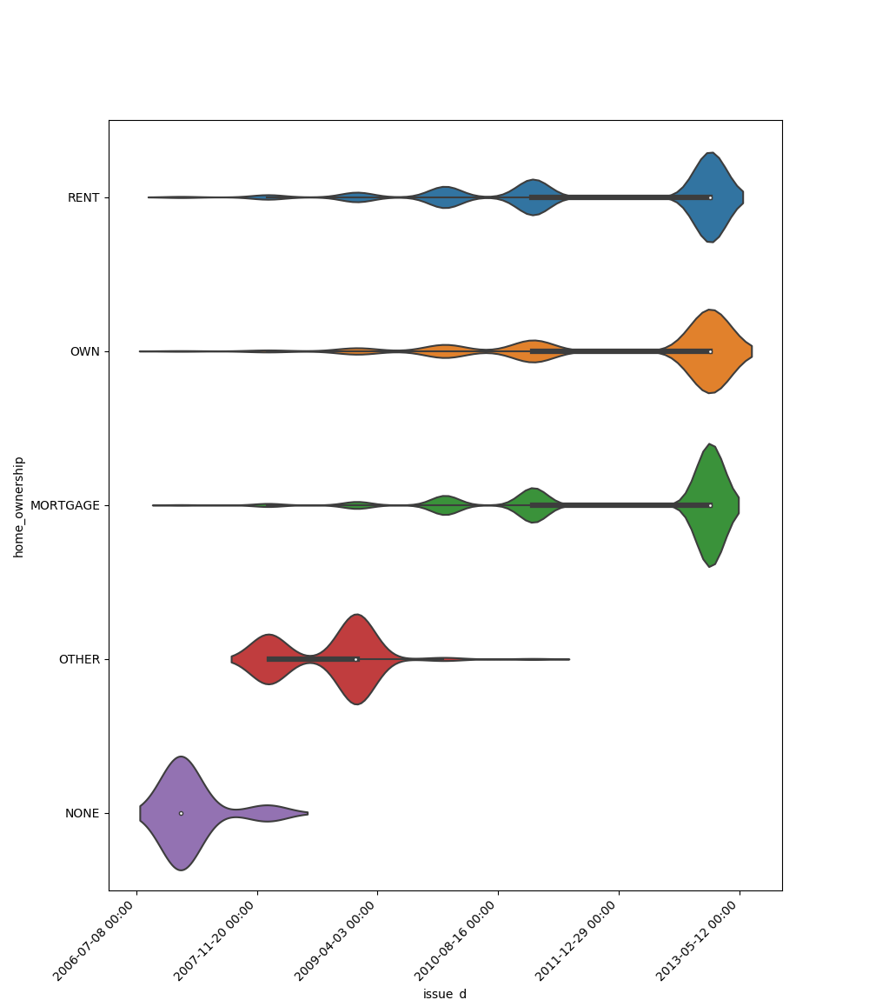
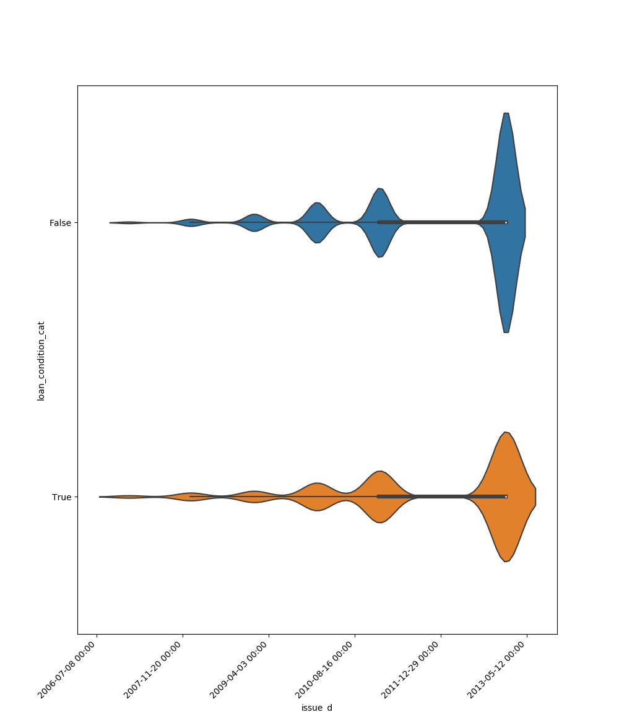
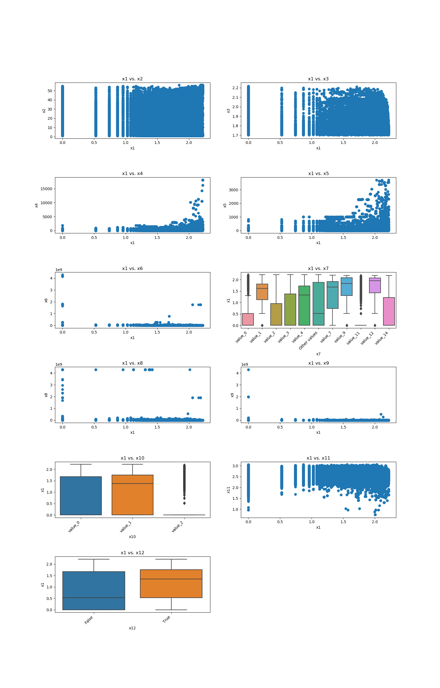

##################
Visualization Aids
##################
The module of visualization aids contains methods that visualize by drawing or printing ML output.

******************
Visualize Features
******************
This method was created due a quick solution to long time calculation of Pandas Profiling. This method give a quick
visualization with small latency time.

.. autofunction:: visualization_aids::visualize_features

Code Example
============
The example uses a small sample from of a dataset from
`kaggle <https://www.kaggle.com/mrferozi/loan-data-for-dummy-bank>`_, which a dummy bank provides loans.

Let's see how to use the code::

    import pandas

    from matplotlib import pyplot

    from ds_utils.visualization_aids import visualize_features

    loan_frame = pandas.read_csv(path/to/dataset, encoding="latin1", nrows=11000,
                                 parse_dates=["issue_d"])
    loan_frame = loan_frame.drop("id", axis=1)

    visualize_features(loan_frame)

    pyplot.show()

And the following image will be shown:

**********************
Visualize Correlations
**********************
This method was created due a quick solution to long time calculation of Pandas Profiling. This method give a quick
visualization with small latency time.

.. autofunction:: visualization_aids::visualize_correlations

Code Example
============
For this example I created a dummy data set. You can find the data at the resources directory in the packages tests folder.

Let's see how to use the code::

    import pandas

    from matplotlib import pyplot

    from ds_utils.visualization_aids import visualize_correlations

    data_1M = pandas.read_csv(path/to/dataset)
    visualize_correlations(data_1M)
    pyplot.show()

And the following image will be shown:

***************************
Plot Correlation Dendrogram
***************************
This method was created due the lack of maintenance of the package `EthicalML / xai <https://github.com/EthicalML/XAI>`_.

.. autofunction:: visualization_aids::plot_correlation_dendrogram

Code Example
============

For this example I created a dummy data set. You can find the data at the resources directory in the packages tests folder.

Let's see how to use the code::

    import pandas

    from matplotlib import pyplot

    from ds_utils.visualization_aids import plot_correlation_dendrogram

    data_1M = pandas.read_csv(path/to/dataset)
    plot_correlation_dendrogram(data_1M)
    pyplot.show()

And the following image will be shown:

.. image:: ../../tests/baseline_images/test_visualization_aids/plot_correlation_dendrogram.png
    :align: center
    :alt: Plot Correlation Dendrogram

***************************
Plot Features' Relationship
***************************
This method was created due a quick solution to long time calculation of Pandas Profiling. This method give a quick
visualization with small latency time.

.. autofunction:: visualization_aids::plot_features_relationship

Code Example
============
For this example I created a dummy data set. You can find the data at the resources directory in the packages tests folder.

Let's see how to use the code::

    import pandas

    from matplotlib import pyplot

    from ds_utils.visualization_aids import plot_features_relationship

    data_1M = pandas.read_csv(path/to/dataset)
    plot_features_relationship("x7", "x10", data_1M)
    pyplot.show()

For each different combination of features types a different plot will be shown:

Both Features are Numeric
-------------------------
A scatter plot of the shared distribution is shown:

One Feature is Numeric and The Other is Categorical
---------------------------------------------------
If one feature is numeric, but the the other is either an ``object``, a ``category`` or a ``bool``, then a box
plot is shown. In the plot it can be seen for each unique value of the category feature what is the distribution of the
numeric feature. If the categorical feature has more than 10 unique values, then the 10 most common values are shown and
the other are labeled "Other Values".

Here is an example for boolean feature plot:

Both Features are Categorical
-----------------------------
A shared histogram will be shown. If one or both features have  more than 10 unique values, then the 10 most common
values are shown and the other are labeled "Other Values".

One Feature is Datetime Series and the Other is Numeric or Datetime Series
---------------------------------------------------------------------------
A line plot where the datetime series is at x axis is shown:

One Feature is Datetime Series and the Other is Categorical
-----------------------------------------------------------
If one feature is datetime series, but the the other is either an ``object``, a ``category`` or a ``bool``, then a
violin plot is shown. Violin plot is a combination of boxplot and kernel density estimate. If the categorical feature
has more than 10 unique values, then the 10 most common values are shown and the other are labeled "Other Values". The
datetime series will be at x axis:

Here is an example for boolean feature plot:

Looping One Feature over The Others
-----------------------------------
This code example shows how a loop can be constructed in order to show all of one feature relationship with all the
others::

    import pandas

    from matplotlib import pyplot

    from ds_utils.visualization_aids import plot_features_relationship

    data_1M = pandas.read_csv(path/to/dataset)

    figure, axes = pyplot.subplots(6, 2)
    axes = axes.flatten()
    figure.set_size_inches(16, 25)

    feature_1 = "x1"
    other_features = ["x2", "x3", "x4", "x5", "x6", "x7", "x8", "x9", "x10", "x11", "x12"]

    for i in range(0, len(other_features)):
        axes[i].set_title(f"{feature_1} vs. {other_features[i]}")
        plot_features_relationship(feature_1, other_features[i], data_1M, ax=axes[i])

    figure.delaxes(axes[11])
    figure.subplots_adjust(hspace=0.7)
    pyplot.show()

And the following image will be shown:

