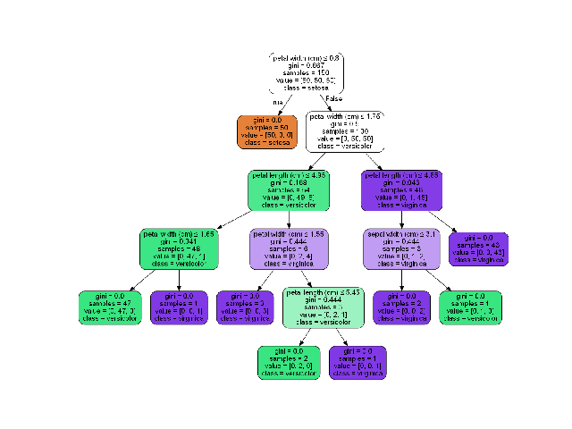
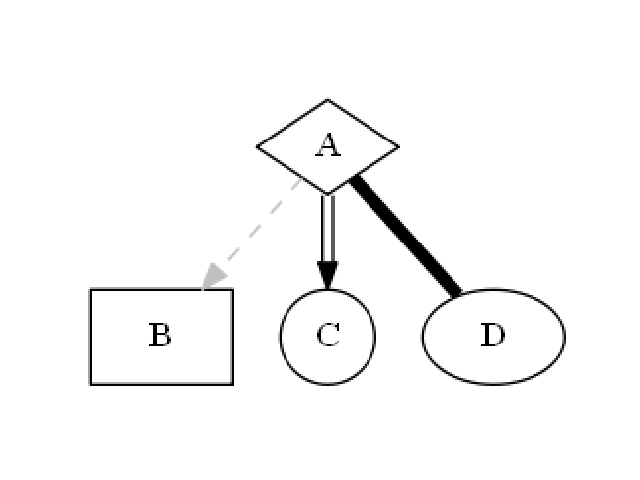
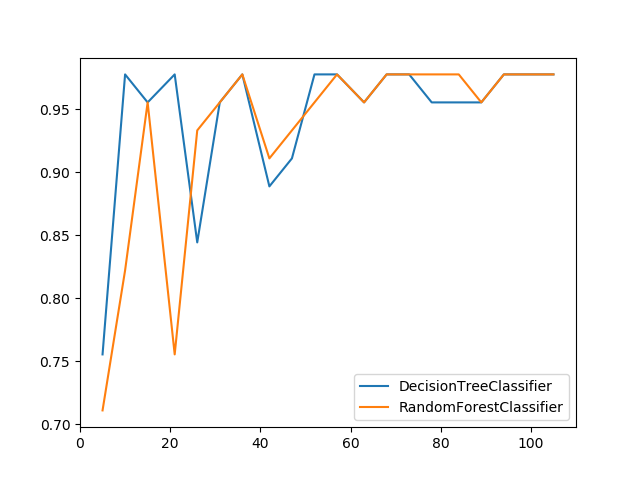

******************
Visualization Aids
******************
The module of visualization aids contains methods that visualize by drawing or printing ML output.

In order for this module to work properly, Graphiz must be installed. In linux based operating systems use::

    sudo apt-get install graphviz

Or using conda::

    conda install graphviz

For more information see `here <https://graphviz.gitlab.io/download>`_.

Draw Tree
=========
.. autofunction:: visualization_aids::draw_tree

.. highlight:: python

Code Example
************
In following examples we are going to use the iris dataset from scikit-learn. so firstly let's import it::

    from sklearn import datasets

    iris = datasets.load_iris()
    x = iris.data
    y = iris.target

We'll create a simple decision tree classifier and plot it::

    from matplotlib import pyplot
    from sklearn.tree import DecisionTreeClassifier

    from ds_utils.visualization_aids import draw_tree

    # Create decision tree classifier object
    clf = DecisionTreeClassifier(random_state=0)

    # Train model
    clf.fit(x, y)

    draw_tree(clf, iris.feature_names, iris.target_names)
    pyplot.show()

And the following image will be shown:

Draw Dot Data
=============

.. autofunction:: visualization_aids::draw_dot_data

Code Example
************
We'll create a simple diagram and plot it::

    from matplotlib import pyplot

    from ds_utils.visualization_aids import draw_dot_data

    dot_data = "digraph D{\n" \
               "\tA [shape=diamond]\n" \
               "\tB [shape=box]\n" \
               "\tC [shape=circle]\n" \
               "\n" \
               "\tA -> B [style=dashed, color=grey]\n" \
               "\tA -> C [color=\"black:invis:black\"]\n" \
               "\tA -> D [penwidth=5, arrowhead=none]\n" \
               "\n" \
               "}"

    draw_dot_data(dot_data)
    pyplot.show()

And the following image will be shown:

Visualize Features
==================
This method was created due a quick solution to long time calculation of Pandas Profiling. This method give a quick
visualization with small latency time.

.. autofunction:: visualization_aids::visualize_features

Code Example
************
The example uses a small sample from of a dataset from
`kaggle <https://www.kaggle.com/mrferozi/loan-data-for-dummy-bank>`_, which a dummy bank provides loans.

Let's see how to use the code::

    import pandas

    from matplotlib import pyplot

    from ds_utils.visualization_aids import visualize_features

    loan_frame = pandas.read_csv(path/to/dataset, encoding="latin1", nrows=11000,
                                 parse_dates=["issue_d"])
    loan_frame = loan_frame.drop("id", axis=1)

    visualize_features(loan_frame)

    pyplot.show()

And the following image will be shown:

.. image:: ../../tests/baseline_images/test_visualization_aids/test_visualize_features.png
    :align: center
    :alt: Features Visualization

Generate Decision Paths
=======================

.. autofunction:: visualization_aids::generate_decision_paths

Code Example
************
We'll create a simple decision tree classifier and print it::

    from matplotlib import pyplot
    from sklearn.tree import DecisionTreeClassifier

    from ds_utils.visualization_aids import generate_decision_paths

    # Create decision tree classifier object
    clf = DecisionTreeClassifier(random_state=0, max_depth=3)

    # Train model
    clf.fit(x, y)
    print(generate_decision_paths(clf, iris.feature_names, iris.target_names.tolist(),
                         "iris_tree"))

.. highlight:: none

The following text will be printed::

    def iris_tree(petal width (cm), petal length (cm)):
        if petal width (cm) <= 0.8000:
            # return class setosa with probability 0.9804
            return ("setosa", 0.9804)
        else:  # if petal width (cm) > 0.8000
            if petal width (cm) <= 1.7500:
                if petal length (cm) <= 4.9500:
                    # return class versicolor with probability 0.9792
                    return ("versicolor", 0.9792)
                else:  # if petal length (cm) > 4.9500
                    # return class virginica with probability 0.6667
                    return ("virginica", 0.6667)
            else:  # if petal width (cm) > 1.7500
                if petal length (cm) <= 4.8500:
                    # return class virginica with probability 0.6667
                    return ("virginica", 0.6667)
                else:  # if petal length (cm) > 4.8500
                    # return class virginica with probability 0.9773
                    return ("virginica", 0.9773)

.. highlight:: python

Plot Metric Growth per Labeled Instances
========================================

.. autofunction:: visualization_aids::plot_metric_growth_per_labeled_instances

Code Example
************
In this example we'll divide the data into train and test sets, decide on which classifiers we want to measure and plot
the results::

    from matplotlib import pyplot
    from sklearn.ensemble import RandomForestClassifier
    from sklearn.model_selection import train_test_split
    from sklearn.tree import DecisionTreeClassifier

    from ds_utils.visualization_aids import plot_metric_growth_per_labeled_instances

    x_train, x_test, y_train, y_test = train_test_split(x, y, test_size=.3, random_state=0)
    plot_metric_growth_per_labeled_instances(x_train, y_train, x_test, y_test,
                                             {"DecisionTreeClassifier":
                                                DecisionTreeClassifier(random_state=0),
                                              "RandomForestClassifier":
                                                RandomForestClassifier(random_state=0, n_estimators=5)})
    pyplot.show()

And the following image will be shown:

