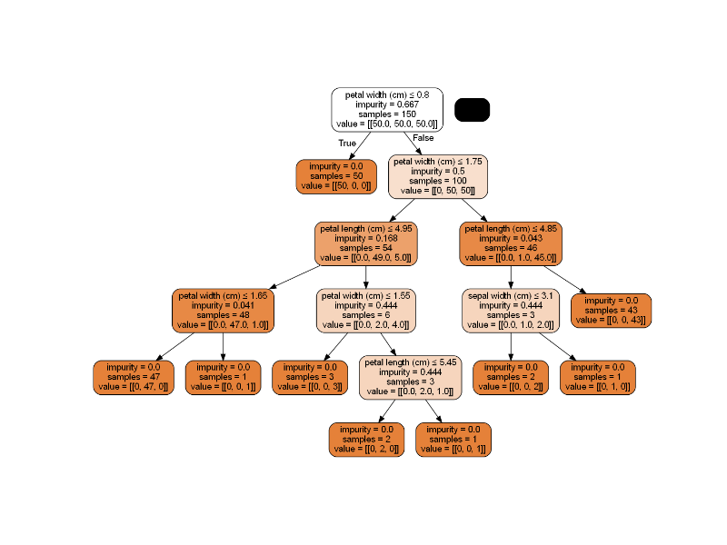
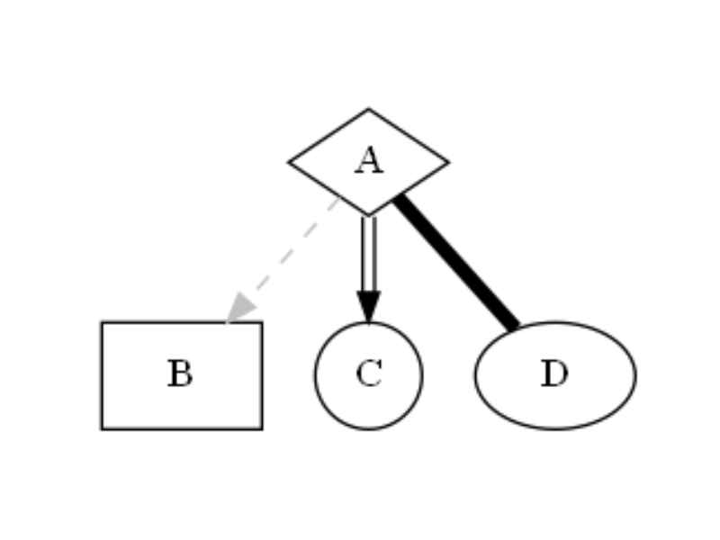
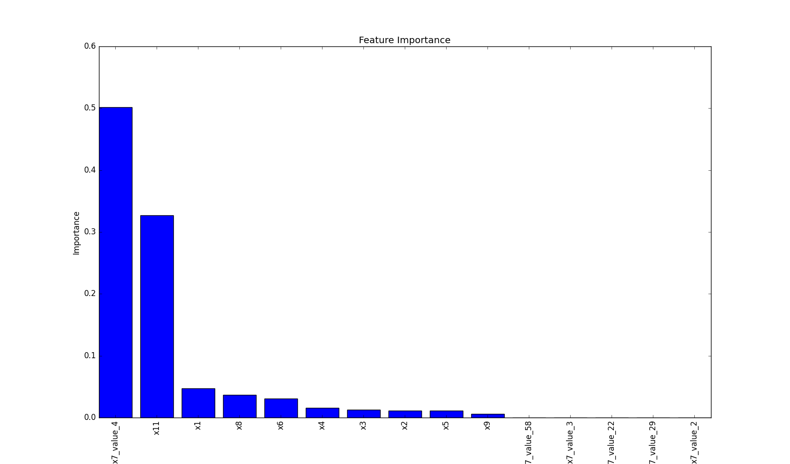
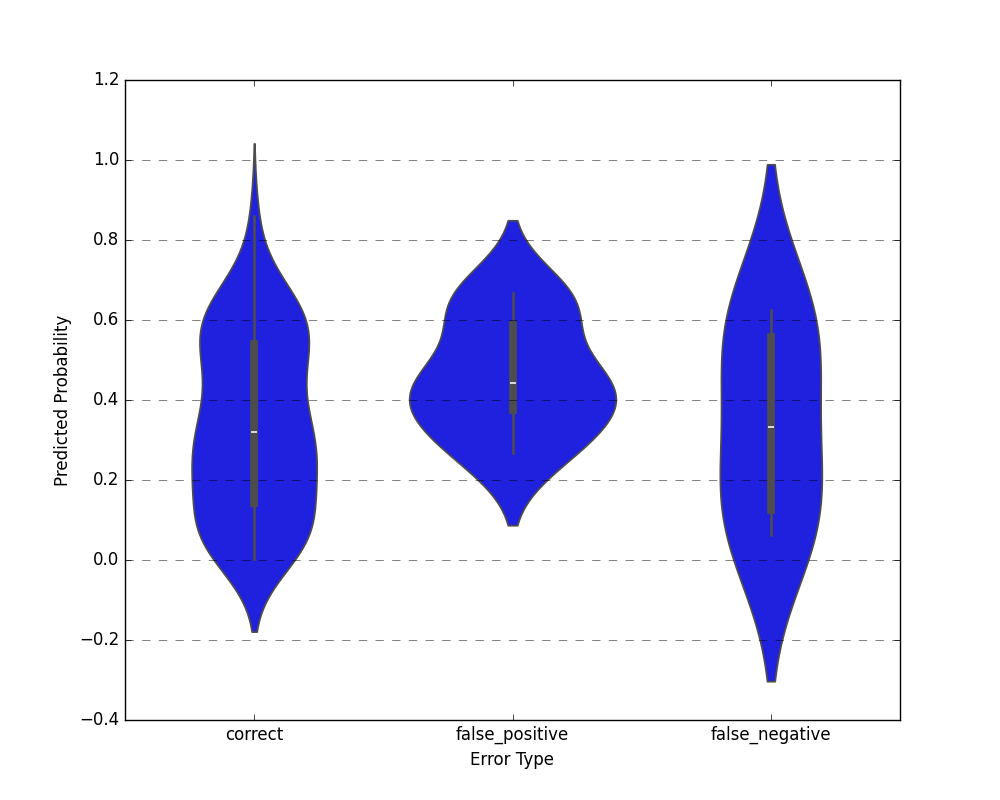

####################
XAI (Explainable AI)
####################
The xai module contains methods that help explain model decisions.

For this module to work properly, Graphviz must be installed. Use the following commands based on your operating system:

For Linux-based systems::

    sudo apt-get install graphviz

For Windows::

    choco install graphviz

For macOS::

    brew install graphviz

Using conda::

    conda install graphviz

For more information, see the `Graphviz download page <https://graphviz.gitlab.io/download>`_.

*********
Draw Tree
*********
.. deprecated:: 1.6.4
    Use `sklearn.tree.plot_tree <https://scikit-learn.org/stable/modules/generated/sklearn.tree.plot_tree.html>`_ instead

The `draw_tree` function visualizes a decision tree classifier, making it easier to understand the tree's structure and decision-making process. This can be particularly useful for model interpretation and debugging.

.. autofunction:: ds_utils.xai.draw_tree

.. highlight:: python

Code Example
============
In the following example, we'll use the iris dataset from scikit-learn:

.. code-block:: python

    from sklearn import datasets

    iris = datasets.load_iris()
    X = iris.data  # Use uppercase 'X' for feature matrix
    y = iris.target

Now, let's create a simple decision tree classifier and plot it:

.. code-block:: python

    import matplotlib.pyplot as plt
    from sklearn.tree import DecisionTreeClassifier
    from ds_utils.xai import draw_tree

    # Create decision tree classifier object
    clf = DecisionTreeClassifier(random_state=0)

    # Train model
    clf.fit(X, y)

    # Draw the tree
    draw_tree(clf, iris.feature_names, iris.target_names)
    plt.show()

The following image will be displayed:

*************
Draw Dot Data
*************

The `draw_dot_data` function visualizes graph structures defined in DOT language. This is useful for creating custom graph visualizations, including decision trees, flowcharts, or any other graph-based representations.

.. autofunction:: ds_utils.xai.draw_dot_data

Code Example
============
Let's create a simple diagram and plot it:

.. code-block:: python

    import matplotlib.pyplot as plt
    from ds_utils.xai import draw_dot_data

    dot_data = """
    digraph D {
        A [shape=diamond]
        B [shape=box]
        C [shape=circle]

        A -> B [style=dashed, color=grey]
        A -> C [color="black:invis:black"]
        A -> D [penwidth=5, arrowhead=none]
    }
    """

    draw_dot_data(dot_data)
    plt.show()

The following image will be displayed:

***********************
Generate Decision Paths
***********************
.. deprecated:: 1.8.0
    Use `sklearn.tree.export_text <https://scikit-learn.org/stable/modules/generated/sklearn.tree.export_text.html>`_ instead

.. py:function:: ds_utils.xai.generate_decision_paths(classifier: BaseDecisionTree, feature_names: List[str] | None = None, class_names: List[str] | None = None, tree_name: str | None = None, indent_char: str = '\t') -> str

*************************
Plot Feature Importance
*************************

The `plot_features_importance` function visualizes the importance of different features in a machine learning model. This is crucial for understanding which features have the most significant impact on the model's predictions, aiding in feature selection and model interpretation.

.. autofunction:: ds_utils.xai.plot_features_importance

Code Example
============

.. highlight:: python

For this example, we'll use a dummy dataset. You can find the data in the resources directory of the package's tests folder.

Here's how to use the code:

.. code-block:: python

    import pandas as pd
    import matplotlib.pyplot as plt
    from sklearn.preprocessing import OneHotEncoder
    from sklearn.tree import DecisionTreeClassifier
    from ds_utils.xai import plot_features_importance

    # Load the dataset
    data_1M = pd.read_csv('path/to/dataset.csv')
    target = data_1M["x12"]
    categorical_features = ["x7", "x10"]

    # Perform one-hot encoding for categorical features
    for feature in categorical_features:
        enc = OneHotEncoder(sparse=False, handle_unknown="ignore")
        enc_out = enc.fit_transform(data_1M[[feature]])
        for i, category in enumerate(enc.categories_[0]):
            data_1M[f"{feature}_{category}"] = enc_out[:, i]

    # Prepare feature list
    features = [col for col in data_1M.columns if col not in ["x12", "x7", "x10"]]

    # Create and train the classifier
    clf = DecisionTreeClassifier(random_state=42)
    clf.fit(data_1M[features], target)

    # Plot feature importance
    plot_features_importance(features, clf.feature_importances_)
    plt.show()

In this example:

- `x12` is the target variable we're trying to predict.
- `x7` and `x10` are categorical features that we one-hot encode.
- The remaining columns (x1, x2, x3, etc.) are numerical features.
- After one-hot encoding, we create a list of all features, excluding the original categorical columns and the target variable.
- We then train a decision tree classifier and plot the importance of each feature.

The following image will be displayed:

**************************
Plot Error Analysis Chart
**************************

The ``plot_error_analysis_chart`` function automates the creation of an error analysis DataFrame (computing correct, false_positive, false_negative) and visualizes the prediction errors relative to their predicted probabilities using a violin plot. It supports both binary and multi-class classification using a one-vs-rest scheme against a specified positive class.

.. autofunction:: ds_utils.xai.plot_error_analysis_chart

Code Example
============

.. highlight:: python

Binary Classification
---------------------

.. code-block:: python

    import matplotlib.pyplot as plt
    from sklearn.datasets import load_breast_cancer
    from sklearn.model_selection import train_test_split
    from sklearn.tree import DecisionTreeClassifier
    from ds_utils.xai import plot_error_analysis_chart

    # Load dataset and split
    X, y = load_breast_cancer(return_X_y=True)
    X_train, X_test, y_train, y_test = train_test_split(X, y, random_state=42)

    # Train a classifier
    clf = DecisionTreeClassifier(random_state=42)
    clf.fit(X_train, y_train)

    y_pred = clf.predict(X_test)
    y_proba = clf.predict_proba(X_test)[:, 1]  # probability of the positive class

    # Plot error analysis
    plot_error_analysis_chart(y_test, y_pred, y_proba, positive_class=1)
    plt.show()

.. image:: ../../tests/baseline_images/test_xai/test_plot_error_analysis_chart/test_plot_error_analysis_chart_binary.png
    :align: center
    :alt: Plot Error Analysis Chart Binary

Multi-class Classification
--------------------------

.. code-block:: python

    import matplotlib.pyplot as plt
    from sklearn.datasets import load_iris
    from sklearn.model_selection import train_test_split
    from sklearn.tree import DecisionTreeClassifier
    from ds_utils.xai import plot_error_analysis_chart

    # Load dataset and split
    X, y = load_iris(return_X_y=True)
    X_train, X_test, y_train, y_test = train_test_split(X, y, random_state=42)

    # Train a classifier
    clf = DecisionTreeClassifier(random_state=42)
    clf.fit(X_train, y_train)

    y_pred = clf.predict(X_test)
    y_proba = clf.predict_proba(X_test)

    # Plot error analysis for class 1 (one-vs-rest)
    plot_error_analysis_chart(
        y_test, y_pred, y_proba,
        positive_class=1,
        classes=clf.classes_.tolist()
    )
    plt.show()

******************************
Generate Error Analysis Report
******************************

The ``generate_error_analysis_report`` function provides a tabular error-analysis report that groups predictions by feature values and computes error metrics per group. It's particularly useful for identifying specific feature ranges or categories where the model underperforms.

.. autofunction:: ds_utils.xai.generate_error_analysis_report

Code Example
============

.. highlight:: python

.. code-block:: python

    import pandas as pd
    import numpy as np
    from sklearn.datasets import load_breast_cancer
    from sklearn.model_selection import train_test_split
    from sklearn.tree import DecisionTreeClassifier
    from ds_utils.xai import generate_error_analysis_report

    # Load dataset and split
    data = load_breast_cancer()
    X = pd.DataFrame(data.data, columns=data.feature_names)
    X["tissue_type"] = np.where(data.target == 1, "benign", "malignant")  # synthetic categorical
    y = data.target
    X_train, X_test, y_train, y_test = train_test_split(X, y, random_state=42)

    # Train a classifier
    clf = DecisionTreeClassifier(random_state=42, max_depth=3)
    clf.fit(X_train[["mean radius", "mean texture"]], y_train)

    y_pred = clf.predict(X_test[["mean radius", "mean texture"]])

    # Generate error analysis report for numerical and categorical features
    report = generate_error_analysis_report(
        X_test, y_test, y_pred,
        feature_columns=["mean radius", "mean texture", "tissue_type"],
        bins=3,
        sort_metric="error_rate",
        ascending=False
    )
    print(report)

The output will be a pandas DataFrame similar to this:

+--------------+-----------------+-------+-------------+------------+----------+
| feature      | group           | count | error_count | error_rate | accuracy |
+==============+=================+=======+=============+============+==========+
| tissue_type  | malignant       | 45    | 5           | 0.111111   | 0.888889 |
+--------------+-----------------+-------+-------------+------------+----------+
| mean radius  | (16.71, 24.933] | 30    | 3           | 0.100000   | 0.900000 |
+--------------+-----------------+-------+-------------+------------+----------+
| mean texture | (25.32, 33.81]  | 17    | 1           | 0.058824   | 0.941176 |
+--------------+-----------------+-------+-------------+------------+----------+
| mean texture | (16.83, 25.32]  | 78    | 4           | 0.051282   | 0.948718 |
+--------------+-----------------+-------+-------------+------------+----------+
| tissue_type  | benign          | 98    | 4           | 0.040816   | 0.959184 |
+--------------+-----------------+-------+-------------+------------+----------+
| mean radius  | (8.471, 16.71]  | 113   | 4           | 0.035398   | 0.964602 |
+--------------+-----------------+-------+-------------+------------+----------+
| mean texture | (8.315, 16.83]  | 48    | 2           | 0.041667   | 0.958333 |
+--------------+-----------------+-------+-------------+------------+----------+

*(Note: The tissue_type rows use raw string values as groups, while numerical features are binned. Exact values and bins may vary based on data distribution.)*