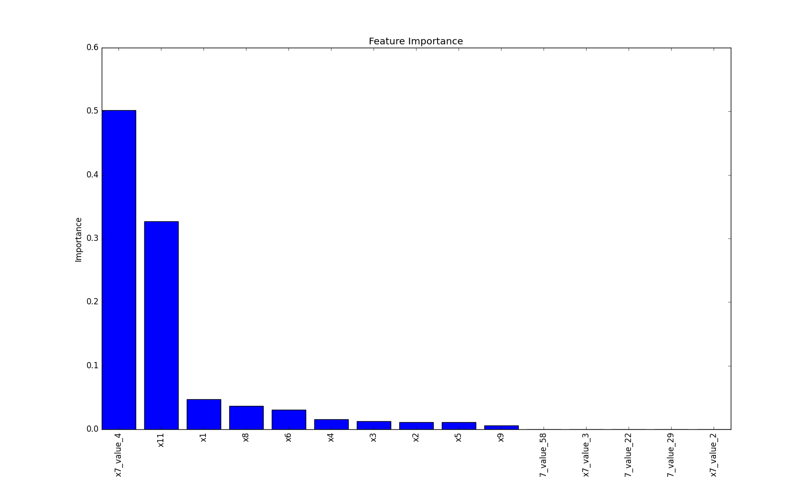

####################
XAI (Explainable AI)
####################
The xai module contains methods that help explain model decisions.

For this module to work properly, Graphviz must be installed. Use the following commands based on your operating system:

For Linux-based systems::

    sudo apt-get install graphviz

For Windows::

    choco install graphviz

For macOS::

    brew install graphviz

Using conda::

    conda install graphviz

For more information, see the `Graphviz download page <https://graphviz.gitlab.io/download>`_.

*********
Draw Tree
*********
.. deprecated:: 1.6.4
    Use `sklearn.tree.plot_tree <https://scikit-learn.org/stable/modules/generated/sklearn.tree.plot_tree.html>`_ instead

The `draw_tree` function visualizes a decision tree classifier, making it easier to understand the tree's structure and decision-making process. This can be particularly useful for model interpretation and debugging.

.. autofunction:: xai::draw_tree

.. highlight:: python

Code Example
============
In the following example, we'll use the iris dataset from scikit-learn:

.. code-block:: python

    from sklearn import datasets

    iris = datasets.load_iris()
    X = iris.data  # Use uppercase 'X' for feature matrix
    y = iris.target

Now, let's create a simple decision tree classifier and plot it:

.. code-block:: python

    import matplotlib.pyplot as plt
    from sklearn.tree import DecisionTreeClassifier
    from ds_utils.xai import draw_tree

    # Create decision tree classifier object
    clf = DecisionTreeClassifier(random_state=0)

    # Train model
    clf.fit(X, y)

    # Draw the tree
    draw_tree(clf, iris.feature_names, iris.target_names)
    plt.show()

The following image will be displayed:

*************
Draw Dot Data
*************

The `draw_dot_data` function visualizes graph structures defined in DOT language. This is useful for creating custom graph visualizations, including decision trees, flowcharts, or any other graph-based representations.

.. autofunction:: xai::draw_dot_data

Code Example
============
Let's create a simple diagram and plot it:

.. code-block:: python

    import matplotlib.pyplot as plt
    from ds_utils.xai import draw_dot_data

    dot_data = """
    digraph D {
        A [shape=diamond]
        B [shape=box]
        C [shape=circle]

        A -> B [style=dashed, color=grey]
        A -> C [color="black:invis:black"]
        A -> D [penwidth=5, arrowhead=none]
    }
    """

    draw_dot_data(dot_data)
    plt.show()

The following image will be displayed:

.. image:: ../../tests/baseline_images/test_xai/test_draw_dot_data.png
    :align: center
    :alt: Diagram Visualization

***********************
Generate Decision Paths
***********************
.. deprecated:: 1.8.0
    Use `sklearn.tree.export_text <https://scikit-learn.org/stable/modules/generated/sklearn.tree.export_text.html>`_ instead

The `generate_decision_paths` function creates a textual representation of a decision tree's decision paths. This is helpful for understanding the logic behind the tree's classifications and can be used for both interpretation and debugging purposes.

.. autofunction:: xai::generate_decision_paths

Code Example
============
Let's create a simple decision tree classifier and print its decision paths:

.. code-block:: python

    from sklearn import datasets
    from sklearn.tree import DecisionTreeClassifier
    from ds_utils.xai import generate_decision_paths

    # Load the iris dataset
    iris = datasets.load_iris()
    X = iris.data
    y = iris.target

    # Create decision tree classifier object
    clf = DecisionTreeClassifier(random_state=0, max_depth=3)

    # Train model
    clf.fit(X, y)

    # Generate and print decision paths
    decision_paths = generate_decision_paths(clf, iris.feature_names, iris.target_names.tolist(), "iris_tree")
    print(decision_paths)

.. highlight:: none

The following text will be printed:

.. code-block:: python

    def iris_tree(petal width (cm), petal length (cm)):
        if petal width (cm) <= 0.8000:
            # return class setosa with probability 0.9804
            return ("setosa", 0.9804)
        else:  # if petal width (cm) > 0.8000
            if petal width (cm) <= 1.7500:
                if petal length (cm) <= 4.9500:
                    # return class versicolor with probability 0.9792
                    return ("versicolor", 0.9792)
                else:  # if petal length (cm) > 4.9500
                    # return class virginica with probability 0.6667
                    return ("virginica", 0.6667)
            else:  # if petal width (cm) > 1.7500
                if petal length (cm) <= 4.8500:
                    # return class virginica with probability 0.6667
                    return ("virginica", 0.6667)
                else:  # if petal length (cm) > 4.8500
                    # return class virginica with probability 0.9773
                    return ("virginica", 0.9773)

*************************
Plot Feature Importance
*************************

The `plot_features_importance` function visualizes the importance of different features in a machine learning model. This is crucial for understanding which features have the most significant impact on the model's predictions, aiding in feature selection and model interpretation.

.. autofunction:: xai::plot_features_importance

Code Example
============

.. highlight:: python

For this example, we'll use a dummy dataset. You can find the data in the resources directory of the package's tests folder.

Here's how to use the code:

.. code-block:: python

    import pandas as pd
    import matplotlib.pyplot as plt
    from sklearn.preprocessing import OneHotEncoder
    from sklearn.tree import DecisionTreeClassifier
    from ds_utils.xai import plot_features_importance

    # Load the dataset
    data_1M = pd.read_csv('path/to/dataset.csv')
    target = data_1M["x12"]
    categorical_features = ["x7", "x10"]

    # Perform one-hot encoding for categorical features
    for feature in categorical_features:
        enc = OneHotEncoder(sparse=False, handle_unknown="ignore")
        enc_out = enc.fit_transform(data_1M[[feature]])
        for i, category in enumerate(enc.categories_[0]):
            data_1M[f"{feature}_{category}"] = enc_out[:, i]

    # Prepare feature list
    features = [col for col in data_1M.columns if col not in ["x12", "x7", "x10"]]

    # Create and train the classifier
    clf = DecisionTreeClassifier(random_state=42)
    clf.fit(data_1M[features], target)

    # Plot feature importance
    plot_features_importance(features, clf.feature_importances_)
    plt.show()

In this example:

- `x12` is the target variable we're trying to predict.
- `x7` and `x10` are categorical features that we one-hot encode.
- The remaining columns (x1, x2, x3, etc.) are numerical features.
- After one-hot encoding, we create a list of all features, excluding the original categorical columns and the target variable.
- We then train a decision tree classifier and plot the importance of each feature.

The following image will be displayed:

