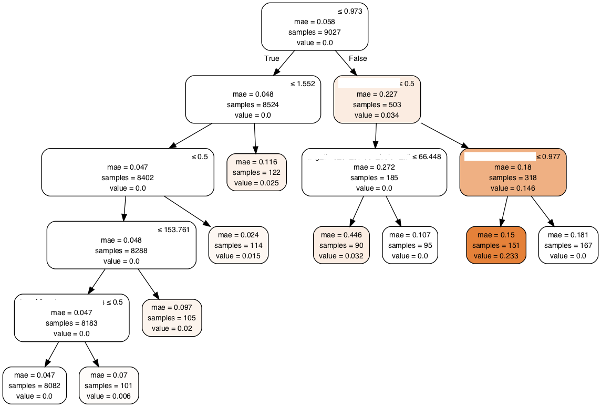

# visualization_aid
Contains common methods to help draw and visualize a machine learning model.
## draw_tree
This method using graphviz draw a given tree.

Input:
* tree - decision tree.
* features_names - the features names.

Example:
```python
from sklearn.tree import DecisionTreeClassifier
from ds_utils.visualization_aids import draw_tree


model = DecisionTreeClassifier()
model.fit(X_train, y_train)
plot = draw_tree(model, X_train.columns)
```

Output:
