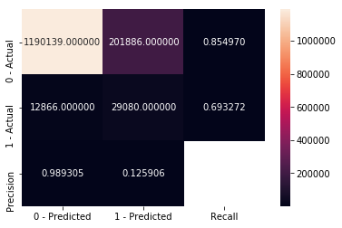

# Metrics
## print_confusion_matrix
Prints the confusion matrix using seaborn.

Input:
* y_test - true labels.
* y_pred - predicted labels.
* positive_label - what is the positive label.
* negative_label - what is the negative label.

Example:
```python
from sklearn.tree import DecisionTreeClassifier
from ds-utils.metrics import print_confusion_matrix


model = DecisionTreeClassifier()
model.fit(X_train, y_train)
print_confusion_matrix(y_test, model.predict(X_test), 1, 0)
```

Output:
```bash
False Positive Rate: 0.1450
False Negative Rate: 0.3067
Confusion Matrix:
```

```
Accuracy: 0.8502
F1 Score: 0.2131
```

## plot_roc_curve
Prints the roc curve using matplotlib.

Input:
* y_test - true labels.
* y_score - predicted probability for positive_label.
* positive_label - what is the positive label.

Example:
```python
from sklearn.tree import DecisionTreeClassifier
from ds-utils.metrics import plot_roc_curve


model = DecisionTreeClassifier()
model.fit(X_train, y_train)
plot_roc_curve(y_test, model.predict_proba(X_test)[:, 1], 1)
```

Output:


# Strings
## append_tags_to_frame
Extracts tags from a given field and append them as dataframe.

Input:
* x_train - Pandas' dataframe with the train features.
* x_test - Pandas' dataframe with the test features.
* field_name - the feature to parse.
* prefix - the given prefix for new tag feature.
* min_df - ignore terms that have a document frequency strictly lower than the given threshold.
* binary - If True, all non zero counts are set to 1.

Example:
```python
from ds-utils.strings import append_tags_to_frame

X_train_with_tags, X_test_with_tags = append_tags_to_frame(X_train, X_test, "article_tags", "tag_", 10, True)
```

# visualization_aid
## draw_tree
This method using graphviz draw a given tree.

Input:
* tree - decision tree.
* features_names - the features names.

Example:
```python
from sklearn.tree import DecisionTreeClassifier
from ds-utils.visualization_aid import draw_tree


model = DecisionTreeClassifier()
model.fit(X_train, y_train)
plot = draw_tree(model, X_train.columns)
```

Output:
